# Maximal assurance program (176 epics, maximal coverage)

## Executable interpretation — exclude nothing

| Rule | Meaning |
|------|---------|
| Automatable | Must land as **code/config/data** in-repo. |
| Not automatable today | **`artifacts/assurance/waivers/*.json`** with `expiresAt`, `owner`, `reason`, `compensatingControlRef` → script/test id. |
| Docs-only | **Out of scope** as deliverable; replace with **machine substitute** (script gate, workflow, JSON schema, test). |
| Silent omission | **Forbidden**—Epics **38**, **48**, **64**, **80**, **96**, **116**, **136** detect drift, orphans, tampered plan artifact, or **stale program semver**; **Epic 156** enforces **signed assurance bundle** when `ASSURANCE_BUNDLE_SIGNING=required`; **Epic 176** enforces **tamper-evident audit hash chain** when `ASSURANCE_AUDIT_CHAIN=required`. |

## Repo anchors

- Cron parity: [`scripts/check-vercel-cron-canary-parity.mjs`](scripts/check-vercel-cron-canary-parity.mjs), [`scripts/cron-route-expected-keys.mjs`](scripts/cron-route-expected-keys.mjs).
- Cron HTTP: [`scripts/cron-canary.mjs`](scripts/cron-canary.mjs), [`scripts/comprehensive-pass.mjs`](scripts/comprehensive-pass.mjs).
- Auth: [`src/lib/security/cron-route-gate.ts`](src/lib/security/cron-route-gate.ts), [`src/lib/security/cron-auth.ts`](src/lib/security/cron-auth.ts).
- CI skip risk: [`.github/workflows/cron-canary.yml`](.github/workflows/cron-canary.yml).
- Wrapper inventory: [`scripts/check-wrapper-reintroduction.mjs`](scripts/check-wrapper-reintroduction.mjs), [`scripts/pipelines/`](scripts/pipelines/) verify pipelines.

## Coverage completeness metric (Epics 64 + 80)

Define **`coverageScore`** and **subscores** in [`scripts/coverage-completeness.mjs`](scripts/coverage-completeness.mjs) (new):

- **`coverageScore` (composite):** weighted blend of subscores below (weights in [`artifacts/assurance/coverage-weights.json`](artifacts/assurance/coverage-weights.json)).
- **`threatEvidenceScore`:** numerator/denominator over [`artifacts/assurance/threat-rows.json`](artifacts/assurance/threat-rows.json) rows with passing `evidenceScriptOrTest`.
- **`registryEvidenceScore`:** api-runtime-smoke + cron-canary rows exercised in last N days.
- **`scriptMappedScore`:** % of `scripts/check-*` present in [`artifacts/assurance/scripts-to-epic-map.json`](artifacts/assurance/scripts-to-epic-map.json) (Appendix D).
- **`npmScriptScheduledScore`:** % of `package.json` scripts satisfied per Appendix E.
- **`naWaiverHygieneScore`:** % of `na` rows with future `expiresAt` and non-expired `compensatingControlRef`.
- **`securityFindingScore`:** normalized Semgrep/CodeQL/Trivy **open** counts vs baseline (Epics 52, 65, 66), **after VEX merge** (Appendix **J**).
- **`registryIntegrityScore`:** binary gates—**Epic 96** (`epics.json` ↔ plan/todos/taxonomy, cardinality **176**, contiguous ids) + **Epic 116** (committed plan SHA256 match) + **Epic 136** (`programVersion` semver bumps when phasing/taxonomy/cardinality changes) + **Epic 156** (when signing policy **required**, manifest signature verifies over aggregated digests) + **Epic 176** (when **`ASSURANCE_AUDIT_CHAIN=required`**, chain head verifies); contribute to composite once scaffolding flips from `--report-only`.
- **Gate:** [`artifacts/assurance/coverage-threshold.json`](artifacts/assurance/coverage-threshold.json) stores minimums per subscore + composite; failing **`check:coverage-completeness`** on nightly/release.

**Epic 80** publishes [`artifacts/assurance/dashboard.json`](artifacts/assurance/dashboard.json) (CI artifact) merging: composite + subscores + upstream status (Epic 79) + SLO budget deltas + workflow last-run hashes—**single machine-readable health surface** (no prose dashboard).

This makes “exclude nothing” **measurable** and **aggregated**.

```mermaid
flowchart TB
  subgraph T0 [T0_Cron_CI]
    E1[E1] --> E2[E2]
  end
  subgraph T1 [T1_Runtime_smoke_UI]
    E3[E3] --> E7[E7]
    E19[E19]
  end
  subgraph T2 [T2_Unit_static_depth]
    E4[E4] --> E15[E15] --> E16[E16]
    E17[E17]
    E25[E25] --> E26[E26]
    E29[E29]
    E33[E33]
    E36[E36] --> E37[E37]
    E41[E41]
  end
  subgraph T3 [T3_Data]
    E5[E5]
  end
  subgraph T4 [T4_Integrations]
    E11[E11]
    E18[E18]
    E20[E20] --> E21[E21] --> E22[E22]
    E23[E23]
  end
  subgraph T5 [T5_NFR]
    E6[E6]
    E8[E8] --> E9[E9]
    E10[E10] --> E30[E30]
    E27[E27]
    E43[E43]
    E44[E44]
  end
  subgraph T6 [T6_Governance_privacy]
    E12[E12] --> E13[E13] --> E38[E38]
    E14[E14]
    E28[E28]
    E31[E31] --> E42[E42]
    E32[E32]
    E39[E39]
    E45[E45] --> E48[E48]
    E46[E46] --> E47[E47]
  end
  subgraph T7 [T7_Local_infra_optional]
    E40[E40]
  end
  subgraph T8 [T8_Supply_chain_integrity]
    E49[E49]
    E50[E50]
    E51[E51]
    E52[E52]
    E53[E53]
    E55[E55]
    E60[E60]
    E63[E63]
  end
  subgraph T9 [T9_Time_crypto_streams_audit]
    E56[E56]
    E57[E57]
    E61[E61]
    E62[E62]
  end
  subgraph T10 [T10_Locale_PWA_geo_metric]
    E54[E54]
    E58[E58]
    E59[E59]
    E64[E64]
  end
  subgraph T11 [T11_Enterprise_compliance_fuzz_agg]
    E65[E65]
    E66[E66]
    E67[E67]
    E68[E68]
    E69[E69]
    E70[E70]
    E71[E71]
    E72[E72]
    E73[E73]
    E74[E74]
    E75[E75]
    E76[E76]
    E77[E77]
    E78[E78]
    E79[E79]
    E80[E80]
  end
  subgraph T12 [T12_Regulatory_runtime_closure_meta]
    E81[E81]
    E82[E82]
    E83[E83]
    E84[E84]
    E85[E85]
    E86[E86]
    E87[E87]
    E88[E88]
    E89[E89]
    E90[E90]
    E91[E91]
    E92[E92]
    E93[E93]
    E94[E94]
    E95[E95]
    E96[E96]
  end
  subgraph T13 [T13_Cross_border_transports_pdf_meta_closure]
    E97[E97]
    E98[E98]
    E99[E99]
    E100[E100]
    E101[E101]
    E102[E102]
    E103[E103]
    E104[E104]
    E105[E105]
    E106[E106]
    E107[E107]
    E108[E108]
    E109[E109]
    E110[E110]
    E111[E111]
    E112[E112]
    E113[E113]
    E114[E114]
    E115[E115]
    E116[E116]
  end
  subgraph T14 [T14_Alt_protocols_rails_sector_lawful_semver]
    E117[E117]
    E118[E118]
    E119[E119]
    E120[E120]
    E121[E121]
    E122[E122]
    E123[E123]
    E124[E124]
    E125[E125]
    E126[E126]
    E127[E127]
    E128[E128]
    E129[E129]
    E130[E130]
    E131[E131]
    E132[E132]
    E133[E133]
    E134[E134]
    E135[E135]
    E136[E136]
  end
  subgraph T15 [T15_Enterprise_hardening_privacy_next_crypto_bundle]
    E137[E137]
    E138[E138]
    E139[E139]
    E140[E140]
    E141[E141]
    E142[E142]
    E143[E143]
    E144[E144]
    E145[E145]
    E146[E146]
    E147[E147]
    E148[E148]
    E149[E149]
    E150[E150]
    E151[E151]
    E152[E152]
    E153[E153]
    E154[E154]
    E155[E155]
    E156[E156]
  end
  subgraph T16 [T16_Telephony_finance_time_unicode_bot_schema_consumer_audit_chain]
    E157[E157]
    E158[E158]
    E159[E159]
    E160[E160]
    E161[E161]
    E162[E162]
    E163[E163]
    E164[E164]
    E165[E165]
    E166[E166]
    E167[E167]
    E168[E168]
    E169[E169]
    E170[E170]
    E171[E171]
    E172[E172]
    E173[E173]
    E174[E174]
    E175[E175]
    E176[E176]
  end
  T0 --> T1
  T0 --> T2
  T2 --> T3
  T1 --> T4
  T3 --> T4
  T4 --> T5
  T5 --> T6
  T2 --> T6
  T4 --> T7
  T6 --> T8
  T8 --> T9
  T5 --> T10
  T9 --> T10
  T6 --> T11
  T8 --> T11
  T10 --> T11
  T6 --> T12
  T11 --> T12
  T5 --> T12
  T12 --> T13
  T11 --> T13
  T6 --> T13
  T13 --> T14
  T11 --> T14
  T8 --> T14
  T6 --> T14
  T14 --> T15
  T3 --> T15
  T5 --> T15
  T11 --> T15
  T6 --> T15
  T15 --> T16
  T4 --> T16
  T9 --> T16
  T11 --> T16
  T2 --> T16
  T6 --> T16
```

*Tracks **T0–T16** are illustrative; canonical epic ids and dependencies live in [`artifacts/assurance/epics.json`](artifacts/assurance/epics.json). Epic **96** fails CI when registry diverges from this plan; Epic **116** fails when committed plan checksum diverges; Epic **136** fails when **`programVersion`** is stale vs structural plan/epic changes; **Epic 156** verifies **Ed25519** assurance-bundle manifest when `ASSURANCE_BUNDLE_SIGNING=required`; **Epic 176** verifies **hash-chained audit manifest** when `ASSURANCE_AUDIT_CHAIN=required`.*

---

## Taxonomy ↔ epic map (expanded — still excludes silent gaps)

| Area | Epics | Notes |
|------|-------|-------|
| Cron HTTP / Vercel parity | 1, 3, 24 | Bearer + header; strict 404; skipped branches |
| GitHub Actions assurance | 2, 27, 39, 48 | No silent skip; SLO; permissions; nightly bundle |
| API runtime smoke | 3, 7, 15, 23 | Registry is source of truth for staging probes |
| Route + action tests | 4, 28, 29 | Colocated tests; mutation/diff; fuzz |
| Postgres RLS / migrations | 5, 25 | Generated table sets; definer/trigger inventory |
| Telemetry / logs / traces | 6 | No secrets in structured logs |
| Playwright / browser | 7, 10, 30, 43, 44, 154 | Registry, a11y, matrix, RAW lag, canary, WCAG 2.3 motion |
| Load / chaos | 8, 9, 33 | k6 soak; faults; resource abuse |
| Stripe / payments | 11, 18 | Corpus + idempotency |
| Waivers / catalog | 12, 13, 38 | Waivers + orphan requirement detector |
| Evidence-style compliance scripts | 14, 42 | Subprocessors, consent JSON schema |
| AuthZ / AuthN runtime | 16, 32 | Horizontal org; cookies/session/TLS pack |
| Middleware / Next / Vercel | 17, 37 | Matcher drift; edge vs node AST |
| Rate limits / replay | 18 | 429 semantics |
| Storage / Realtime | 19 | Staging probes |
| OAuth / integrations | 20 | PKCE/state; backoff |
| Extraction / ML safety | 21, 153 | Corpus + validators + weights SBOM |
| Email / messaging | 22, 139 | Sanitize + headers + MTA-STS/DMARC/BIMI alignment |
| Feature flags / kill switches | 24 | Dual-branch |
| OpenAPI | 26 | Drift vs 182 routes |
| Property temporal/money | 29, 34, 167, 168 | Fuzz + calendars + tzdata/leap edges |
| Public SEO / headers | 35 | Metadata + well-known |
| RSC / client leakage | 36 | Scanner depth |
| STRIDE / OWASP linkage | 38 | Row→test linker |
| Docker local harness | 40 | Optional compose |
| Interactive a11y lint | 41 | Naming rules |
| Privacy lifecycle | 31 | DSAR/delete/retention |
| Incident readiness | 45 | Scripts + game-day |
| v8 inventories lockstep | 46 | Same-PR drift prevention |
| Cache revalidation | 47 | Tag/path registry |
| SBOM / lifecycle / deps | 49, 50, 63 | Dual SBOM; renovate ratchet; npm lifecycle |
| Signing / provenance | 51 | Cosign/SLSA when artifacts exist |
| Static analysis SARIF | 52 | Semgrep blocking |
| Secret scan parity | 53 | Pre-commit vs CI |
| PWA / offline / push | 54 | Or generated N/A waiver |
| SRI / third-party scripts | 55 | CSP/img/connect drift |
| Clock skew / crypto time | 56 | Stripe clock + JWT skew |
| Audit immutability | 57 | Append-only enforcement tests |
| Intl / locales | 58 | Plural + formatting matrix |
| Geo / latency simulation | 59 | Optional staging headers |
| WASM / native | 60 | Inventory + CVE gate |
| SSE / WebSocket | 61 | Long-connection inventory |
| Field encryption / KMS | 62 | Key version tests or waiver |
| Completeness ratchet | 64 | Composite + subscores |
| **CodeQL SARIF** | **65** | Baseline diff blocking |
| **Trivy** | **66** | FS + container |
| **dependency-review** | **67** | PR transitive gate |
| **Typosquat scopes** | **68** | Internal publish confusion |
| **License graph** | **69** | Copyleft closure |
| **Export control** | **70** | ECCN-style checklist |
| **ROPA codegen** | **71** | Processing activities JSON |
| **DPIA triggers** | **72** | Migration PII delta |
| **SAML enterprise** | **73** | Or N/A waiver |
| **SCIM** | **74** | Or N/A waiver |
| **Desktop/extension** | **75** | Or N/A generator |
| **Formal invariants** | **76** | fast-check domain core |
| **Fuzz optional** | **77** | Native + HTTP OpenAPI |
| **Perf budgets** | **78** | Route-family JSON |
| **Upstream status** | **79** | Vendor incident RSS/API |
| **Assurance dashboard** | **80** | dashboard.json aggregate |
| **EU AI Act posture** | **81** | Risk checklist JSON |
| **SOC2 evidence rows** | **82** | Control→script linker |
| **PCI scope** | **83** | PAN scanner + waiver |
| **PHI heuristics** | **84** | Migration PHI detector |
| **COPPA / minors** | **85** | Age gate tests |
| **WCAG AAA subset** | **86**, **87**, **165** | AAA automation + experimental metrics + ISO 40500 mapping |
| **npm trusted publishing** | **88** | Provenance hooks |
| **GitHub org policy** | **89** | org-policy.json API probe |
| **Rulesets drift** | **90** | vs branch protection |
| **Public API semver** | **91** | Or na |
| **DB pool stress** | **92** | Exhaustion sim |
| **Cron heap budget** | **93** | Optional growth cap |
| **Cookie SameSite matrix** | **94** | Cross-browser auth |
| **Shadow DOM a11y** | **95** | Or na |
| **Epic registry drift** | **96** | Plan ↔ epics.json (**expected ids 1–176**) |
| **Multi-jurisdiction privacy rows** | **97** | LGPD PIPEDA UK ICO APPI PDPA IN-DPDPA etc.—each `true\|false\|na` + evidenceRef |
| **Schrems II / TIA / SCC machine stub** | **98** | Links subprocessors + transfer register (**115**) |
| **Data residency enforcement** | **99** | Org/workspace routing + storage deny matrix tests |
| **Async messaging brokers** | **100** | SQS SNS PubSub Kafka Rabbit—inventory tests or `messaging_na` |
| **gRPC / protobuf surfaces** | **101** | Repo grep + codegen drift **or** `grpc_na` |
| **Mobile native clients** | **102** | RN/Expo/Flutter scan **or** `mobile_na` generator |
| **Voice assistant skills** | **103** | Alexa/Google manifests **or** `voice_na` |
| **Embedded / smart TV clients** | **104** | WebKit TV inventory **or** `embedded_na` |
| **PDF/UA accessibility exports** | **105** | veraPDF or CI stub on artifact PDFs |
| **Digital signatures on PDFs** | **106** | Verify pipeline **or** waiver |
| **Document watermark / leak trace** | **107** | Stub fingerprint **or** `watermark_na` |
| **ML model card + ethics flag** | **108** | `model-card.json` schema + route linkage |
| **Continuous profiler** | **109** | Pyroscope/Parca staging regressions **or** `profiler_na` |
| **eBPF / Cilium policy** | **110** | Policy tests **or** `k8s_network_policy_na` |
| **Physical datacenter controls** | **111** | Machine checklist **or** perpetual `physical_na` |
| **SIM-swap / telecom consumer auth** | **112** | Checklist **or** `telecom_na` |
| **Assurance meta-SBOM** | **113** | CycloneDX of scripts/tests/workflows as components |
| **ROPA JSON changelog artifact** | **114** | Git diff automation on processing-activities (**71**) |
| **International transfers register** | **115** | Destination + legal mechanism + SCC id rows |
| **Plan document integrity hash** | **116** | SHA256 artifact + CI gate on plan edits |
| **GraphQL / federation surface** | **117** | Apollo/router/subgraph inventory **or** `graphql_federation_na` |
| **MQTT / IoT brokers** | **118** | Client grep + broker contracts **or** `iot_broker_na` |
| **WebXR / immersive Web** | **119** | API scan **or** `webxr_na` |
| **Blockchain / Web3 wallet RPC** | **120** | SIWE/WalletConnect/ethers inventory **or** `web3_na` |
| **Non-card payment rails** | **121** | ACH SEPA wire BNPL Open Banking **or** `payment_rails_na` |
| **HRIS / payroll APIs** | **122** | Connector inventory **or** `hris_na` |
| **Indirect tax engines** | **123** | Avalara Vertex Stripe Tax **or** `tax_engine_na` |
| **Sanctions / PEP screening** | **124** | OFAC-style client hooks **or** `sanctions_screening_na` |
| **Carrier / CPNI-adjacent marketing** | **125** | Consent rows **or** `carrier_compliance_na` |
| **FDA 21 CFR Part 11 style** | **126** | Audit trail / e-record checklist **or** `fda_gxp_na` |
| **FedRAMP / StateRAMP posture** | **127** | Readiness JSON **or** `fedramp_na` + compensating refs |
| **CMMC / ITAR adjunct** | **128** | Defense export adjunct vs Epic **70** **or** `cmmc_itar_na` |
| **PCI PIN / P2PE devices** | **129** | Keyed entry inventory **or** `pci_pin_na` delegated |
| **AI synthetic media disclosure** | **130** | Disclosure threat-rows + UI contracts **or** waiver |
| **Biometric templates** | **131** | Beyond WebAuthn ceremony **or** `biometric_na` |
| **CSAM hash / PhotoDNA** | **132** | Integration inventory **or** explicit `csam_matching_na` capability row |
| **Lawful access playbook** | **133** | Government demand JSON SLA **or** `lawful_access_na` |
| **Legal hold / e-discovery** | **134** | Propagation tests **or** `legal_hold_na` |
| **SLA breach warranty bundle** | **135** | Customer SLA JSON vs SLO (**27**) **or** `sla_warranty_na` |
| **Assurance program semver** | **136** | `programVersion` in `epics.json` bump gate |
| **LDAP / Active Directory** | **137** | Directory bind/sync inventory **or** `ldap_ad_na` |
| **Kerberos / SPNEGO / negotiate** | **138** | Enterprise negotiate auth **or** `kerberos_na` |
| **MTA-STS TLS-RPT DMARC BIMI** | **139** | Per-domain mail security JSON vs DNS **or** `mail_security_na` |
| **Redis / Memcached abuse** | **140** | Cache poisoning key injection tests **or** `cache_layer_na` |
| **Search DSL injection** | **141** | OpenSearch ES Meilisearch Algolia corpus **or** `search_backend_na` |
| **Postgres replica lag / consistency** | **142** | Lag simulation + RAW adjunct (**43**) **or** `replica_na` |
| **Warehouse / lakehouse connectors** | **143** | Snowflake BQ Databricks **or** `warehouse_na` |
| **CRM connectors** | **144** | Salesforce HubSpot Marketo **or** `crm_na` |
| **CDN / WAF drift** | **145** | Managed rules JSON **or** `cdn_waf_na` |
| **Privacy Sandbox / CHIPS / Topics** | **146** | Cookie + Ads API matrix **or** `privacy_sandbox_na` |
| **Session replay analytics** | **147** | FullStory-style SDK inventory + consent **or** `session_replay_na` |
| **JIT break-glass access audit** | **148** | Privileged session JSON **or** `jit_access_na` |
| **Secrets rotation evidence** | **149** | KMS/key rotation schedules artifact **or** `rotation_evidence_na` |
| **OpenLineage data lineage** | **150** | Lineage hooks **or** `data_lineage_na` |
| **Confidential computing TEE** | **151** | SEV/SNP/Nitro inventory **or** `confidential_compute_na` |
| **Post-quantum TLS readiness** | **152** | Hybrid PQ tracking JSON **or** `pq_tls_na` |
| **ML weights SBOM** | **153** | Checkpoints CycloneDX ML-BOM **or** `ml_weights_na` |
| **WCAG 2.3 motion / seizure** | **154** | Vestibular animation suite **or** `motion_na` |
| **Sovereign / air-gap cloud** | **155** | Region/sovereignty checklist **or** `sovereign_cloud_na` |
| **Signed assurance bundle** | **156** | Ed25519 manifest over digests **or** `signing_na` |
| **SIP / VoIP / PSTN** | **157** | WebRTC trunk inventory **or** `telecom_voice_backend_na` |
| **Fax / paper workflows** | **158** | Modem/paper-mail scan **or** `fax_paper_na` |
| **EPUB accessible exports** | **159** | E-reader pipeline **or** `epub_export_na` |
| **Split-horizon DNS** | **160** | Internal resolver JSON **or** `split_dns_na` |
| **NTP / PTP precision time** | **161** | Chrony/finance clock reqs **or** `precision_time_na` |
| **FIX / ISO 20022** | **162** | Institutional messaging **or** `institutional_payments_messaging_na` |
| **SWIFT / correspondent banking** | **163** | Touchpoints **or** `swift_banking_na` |
| **Scope 3 carbon JSON** | **164** | Extends Appendix **N** **or** `scope3_carbon_na` |
| **ISO/IEC 40500 mapping** | **165** | Formal WCAG criterion rows **or** `iso40500_na` |
| **Unicode TR39 confusables** | **166** | Homoglyph detection on identifiers **or** `confusables_na` |
| **IANA tzdata drift** | **167** | tzdb vs runtime **or** `tzdata_drift_na` |
| **Leap-second smearing** | **168** | POSIX timestamp edges **or** `leap_second_na` |
| **CAPTCHA / bot mitigation** | **169** | Turnstile/reCAPTCHA inventory **or** `captcha_na` |
| **PKCS#11 / app HSM** | **170** | Token hooks **or** `pkcs11_hsm_na` |
| **Mobile attestation** | **171** | DeviceCheck Play Integrity **or** `mobile_attestation_na` |
| **CRDT multi-master** | **172** | Conflict simulation **or** `crdt_na` |
| **Event sourcing projections** | **173** | Lag/replay tests **or** `event_sourcing_na` |
| **Schema registry evolution** | **174** | Avro/Proto breaking gate **or** `schema_registry_na` |
| **Dark-pattern / deceptive UX** | **175** | FTC-style checklist **or** `dark_pattern_na` |
| **Tamper-evident audit chain** | **176** | Hash-chained assurance log **or** `audit_chain_na` |

---

## Epics 1–30 (expanded sub-scope)

### Epic 1 — Cron runtime parity
- Shared [`scripts/lib/cron-http-probe.mjs`](scripts/lib/cron-http-probe.mjs): unsigned; **Bearer**; **`x-cron-secret`**; validate JSON keys + V5 `skipped` rules.
- Env: **`CRON_CANARY_STRICT_NO_SKIP_404`**, **`CRON_CANARY_FAIL_ON_OK_FALSE`**.
- Discover **GET/POST** (and rare methods) from filesystem or extend [`scripts/cron-route-expected-keys.mjs`](scripts/cron-route-expected-keys.mjs) with method metadata when paths differ.
- Assert **`Content-Type: application/json`** on success responses (already in comprehensive-pass—reuse).

### Epic 2 — CI fail-closed
- Every workflow under [`.github/workflows/`](.github/workflows/) that requires secrets: **fail** unless explicit **`ALLOW_<WORKFLOW>_SKIP`** or unified **`ALLOW_SECRET_GATED_SKIP`** (single variable; only explained in workflow comment strings, not prose docs).
- Enumerate in [`scripts/check-github-scheduled-workflows-secrets.mjs`](scripts/check-github-scheduled-workflows-secrets.mjs) (new): **scheduled** jobs must declare required secrets + opt-out variable name.

### Epic 3 — API runtime smoke registry
- Categories **complete**: session JSON, Stripe wrong sig, worker bearer, internal diag, external-actions tokens (all templates), nav-badges, product-telemetry, export tokens, tracking pixels, maintenance routes (admin/cron-only), **reports/webhooks/notifications** families, **extract/run**, **policy/simulate**, **capacity**, **intelligence** APIs—every **non-cron** `route.ts` either has a **registry row** or **`waived`** id referencing Epic 12.
- Runner outputs **JUnit or JSON artifact** for CI UI.

### Epic 4 — Route + Server Action depth
- Allowlist → **zero**; bundle allowlist entries must reference **`bundleProofTest`** path verified by script.
- Grep-driven remediation for **`startTransition(async`**, bare **`server action`** throws on dashboard paths.

### Epic 5 — Data plane
- [`artifacts/assurance/rls-sanity-tables.json`](artifacts/assurance/rls-sanity-tables.json): codegen + human review queue.
- Optional **Supabase disposable DB** smoke (`check:v10-migration-smoke` pattern) wired to epic-owned script.

### Epic 6 — Observability
- **`routeId`** stable string per `route.ts` (path template); correlate Sentry + logs.
- Redaction unit tests for structured log payloads.

### Epic 7 — Playwright
- Import registry rows as JSON fixture for parameterization.
- **bfcache** / back-navigation spot checks for critical flows (optional flag).

### Epic 8 — Load
- Scenarios: **read-heavy** GET JSON, **cron fan-in** simulation, **auth login** rate smoke (staging only).

### Epic 9 — Chaos
- Matrix: timeout, DNS failure, **chunked abort**, **half-close**—map to [`src/lib/integration/`](src/lib/integration/) mocks.

### Epic 10 — A11y
- **Focus return** on dialog close route transitions; **live region** job completion.
- **Zoom 400%** layout smoke for shell (Playwright viewport + assertions).

### Epic 11 — Stripe
- Branches: subscription lifecycle, invoice failures, dispute placeholders if coded; **portal session** route env alignment tests.

### Epic 12 — Waivers
- JSON Schema for waiver files checked into CI (`ajv` or similar in script).

### Epic 13 — Catalog index
- Import taxonomy rows from Epic 38 linker output—single graph.

### Epic 14 — Evidence scripts
- Each script emits **typed exit meta** JSON consumable by Epic 48 scheduling checker.

### Epic 15 — HTTP semantics
- **HEAD** parity where GET exists and safe; **Conditional GET** if handlers implement ETag.

### Epic 16 — AuthZ matrix
- **`403` vs `404`** enumeration policy tests per family (avoid org existence leaks where policy demands).

### Epic 17 — Config drift
- **`next.config.ts/js`** header exports compared to [`scripts/check-security-headers.mjs`](scripts/check-security-headers.mjs) expectations if present.

### Epic 18 — Rate limit + idempotency
- **`notification_deliveries`** / outbound event replay suites tied to [`webhooks/dispatch`](src/app/api/webhooks/dispatch).

### Epic 19 — Storage / Realtime
- **CORS** misconfiguration negative tests on buckets (if test project allows).

### Epic 20 — OAuth / integrations
- **Revoked refresh token** path for [`integrations/refresh-tokens`](src/app/api/integrations/refresh-tokens).

### Epic 21 — Extraction / ML
- **Model/version** pin assertions in env (`FEATURE_*` / provider config).

### Epic 22 — Email / messaging
- **Bounce** webhook simulations if inbound path exists; else waiver.

### Epic 23 — Import/export/evidence
- **Async job poll** race tests; **terminal state** idempotency.

### Epic 24 — Feature flags
- **Kill-switch global off** must **alert** in metrics test (counter increment expectation).

### Epic 25 — DB inventory
- **`pg_policies`**-style documentation JSON generated from migrations for reviewer diff.

### Epic 26 — OpenAPI
- Breaking change detector on OpenAPI file semver.

### Epic 27 — SLO / HC
- **`HC_CRON_CANARY_PING`** must receive **/fail** on step failure—assert end-to-end in workflow YAML test (dry-run script parsing).

### Epic 28 — Mutation / diff coverage
- Per-PR report artifact uploaded.

### Epic 29 — Property fuzz
- Include **Unicode normalization** IDs; **homoglyph** slug attempts if slugs user-facing.

### Epic 30 — Multi-browser / visual / i18n
- **Firefox/WebKit** for authenticated smoke subset beyond chromium-only defaults.
- Visual **threshold** ratchet in [`scripts/check-playwright-stability-threshold.mjs`](scripts/check-playwright-stability-threshold.mjs).

---

## Epics 31–48 (new tracks — still code-only)

### Epic 31 — Privacy / data lifecycle
- Integration tests: **export** includes contracted tables/columns list JSON snapshot.
- **Deletion**/`anon` requests propagate (respect FK migrations like [`064_public_auth_users_fk_on_delete.sql`](supabase/migrations/064_public_auth_users_fk_on_delete.sql)).
- Retention cron assertions hook [`maintenance/prune-operational-data`](src/app/api/maintenance/prune-operational-data) expected counts.

### Epic 32 — Session / cookie / transport bridge
- Consolidate executable checks for cookie attributes, **`SameSite`**, **`__Host-`**, HSTS, CSP nonces (where [`scripts/check-csp-nonce-hash-consistency.mjs`](scripts/check-csp-nonce-hash-consistency.mjs) applies)—each mapped to catalog IDs in Epic 13.

### Epic 33 — Abuse / resource limits
- Vitest: oversized **URL**, **header**, **body** rejection paths per middleware/handler.
- **Pagination cap** enforcement (`limit=` tampering) on list endpoints representative sample.

### Epic 34 — Time / money / calendars
- Property tests across [`src/lib/money/`](src/lib/money/), [`src/lib/integrations/calendar.ts`](src/lib/integrations/calendar.ts), reminders math—DST boundaries, month-end, leap day.

### Epic 35 — Public SEO / security headers
- Vitest on [`src/lib/marketing/`](src/lib/marketing/) metadata helpers; `robots`, `sitemap`, [`check:pwa-well-known`](package.json) linkage.

### Epic 36 — RSC / client leakage
- Deepen [`scripts/check-next-public-surface.mjs`](scripts/check-next-public-surface.mjs), [`scripts/check-client-bundle-secret-leakage.mjs`](scripts/check-client-bundle-secret-leakage.mjs)—add **new risky patterns** as denylist grows.

### Epic 37 — Edge vs Node runtime
- Parse `export const runtime = 'edge'` routes; AST-ban **`fs`**, **`child_process`**, Node-only APIs in those files.

### Epic 38 — STRIDE / OWASP ASVS linker
- [`artifacts/assurance/threat-rows.json`](artifacts/assurance/threat-rows.json): each row requires **`evidenceScriptOrTest`**; [`scripts/check-threat-row-coverage.mjs`](scripts/check-threat-row-coverage.mjs) fails on orphans.

### Epic 39 — Workflow permissions matrix
- Extend [`scripts/check-github-workflows-security.mjs`](scripts/check-github-workflows-security.mjs): **`permissions:`** must be minimal; scheduled workflows must not use **`pull_request_target`** without allowlist entry + waiver.

### Epic 40 — Docker / compose harness
- Optional [`docker-compose.assurance.yml`](docker-compose.assurance.yml) + healthcheck script consumed by [`e2e/chaos-local.spec.ts`](e2e/chaos-local.spec.ts) expansion.

### Epic 41 — Accessible naming ratchet
- ast-grep/eslint rule: interactive elements must expose **accessible name** (aria-label, text content, or labelled-by)—incremental adoption with baseline file.

### Epic 42 — Compliance machine artifacts
- **Cookie consent / policy version** JSON in [`artifacts/compliance/`](artifacts/compliance/) validated against schema on each PR touching marketing routes.
- **`check:subprocessors-drift:strict`** gating on release workflow.

### Epic 43 — Read-after-write UI
- Playwright: after mutation, **poll until** UI reflects expected state with injected replication delay mock (only when feature flag enables mock).

### Epic 44 — Canary / blue-green contracts
- Promote [`e2e/blue-green-canary-headers.skip.spec.ts`](e2e/blue-green-canary-headers.skip.spec.ts) patterns into **non-skip** active checks when env provides canary headers.

### Epic 45 — Incident readiness expansion
- Expand [`scripts/check-incident-readiness.mjs`](scripts/check-incident-readiness.mjs) scenarios; add workflow assertion helper for [`qa-game-day.yml`](.github/workflows/qa-game-day.yml) steps count / required secrets.

### Epic 46 — v8 surface lockstep
- PR gate: if `src/app/api/**/route.ts` changes, require matching delta in inventory tests (`check:v8-api-inventory` constituents) or waiver referencing file.

### Epic 47 — Revalidation registry
- [`artifacts/assurance/revalidation-tags.json`](artifacts/assurance/revalidation-tags.json) generated from `revalidateTag(` grep; fail on unknown tags or stale entries.

### Epic 48 — Nightly maximal bundle alignment
- Script compares **Appendix C style** `npm run` list from [`package.json`](package.json) against jobs in [`qa-max-nightly.yml`](.github/workflows/qa-max-nightly.yml), [`qa-code-maximal.yml`](.github/workflows/qa-code-maximal.yml), [`qa-release-candidate.yml`](.github/workflows/qa-release-candidate.yml)—each missing script requires waiver id or auto-add job suggestion in CI log.

---

## Epics 49–64 — Supply chain, crypto-time, streaming, locales, completeness ratchet

### Epic 49 — SBOM dual-format + drift
- Emit **SPDX** and **CycloneDX** in CI artifact; extend [`scripts/check-sbom-diff.mjs`](scripts/check-sbom-diff.mjs) to compare both when present.
- Fail on unexpected license families per [`scripts/check-license-sbom.mjs`](scripts/check-license-sbom.mjs) linkage.

### Epic 50 — Renovate / semver ratchet
- Commit **`renovate.json`** (or equivalent) with scoped managers; add [`scripts/check-dependency-policy.mjs`](scripts/check-dependency-policy.mjs) companion ratchet JSON for **minimum pinned** critical deps (auth, crypto, fetch).

### Epic 51 — Provenance / cosign
- If Docker images or OCI artifacts are published from CI, add **cosign sign** + **`actions/attest-build-provenance`** (or repo-standard) steps; **noop** job when no publish workflow exists (must still emit “skipped with reason” JSON consumed by Epic 64).

### Epic 52 — Semgrep SARIF blocking
- Extend [`semgrep/`](semgrep/) packs; upload SARIF to GitHub **Security** tab; gate merges on **error** severity count threshold (branch protection follow-up via Epic 39).

### Epic 53 — Secret scan parity
- Script compares **local hook** (if present) ruleset hashes vs CI **secretlint/gitleaks** config—drift fails nightly.

### Epic 54 — PWA / offline / push
- Scan repo for **service worker** registration / **`next-pwa`** / **`web-push`** usage; generate tests in [`e2e/`](e2e/) or auto-create **`naWaiverId`** rows in threat registry when absent (exclude nothing: capability is explicit).

### Epic 55 — SRI + third-party surface
- Deepen [`scripts/check-next-script-integrity.mjs`](scripts/check-next-script-integrity.mjs); add Vitest for **CSP** allowlists vs actual script src on marketing layout trees.

### Epic 56 — Clock skew / trusted time
- Stripe **Test Clock** journeys for subscription webhooks; bounded skew tests for session/JWT **`exp`** tolerance (no clock skew beyond policy).

### Epic 57 — Audit immutability
- DB tests asserting **`audit_*`** / `recordV10AuditEvent` tables (as applicable) reject UPDATE/DELETE where policy demands append-only; tied to migration-defined constraints.

### Epic 58 — Intl / locale matrix
- Generated snapshot tests for **every `supportedLocales` / locale enum** used by product—plural rules, **currency** formatting, **RTL** number handling in formatted export strings.

### Epic 59 — Geo / latency simulation
- Staging-only route probes with **`x-forwarded-*`** or Vercel **`x-vercel-id`** regional simulation flags (where supported) + latency injection middleware mock.

### Epic 60 — WASM / native boundary
- Inventory [`package.json`](package.json) optionalDependencies / native addons; link to OSV queries in CI; waiver for accepted risk with expiry.

### Epic 61 — Streaming transports
- Grep inventory for **`ReadableStream`**, **SSE**, **WebSocket** upgrade paths; idle timeout + client disconnect tests **or** bulk waiver referencing “HTTP-only product surface.”

### Epic 62 — Field encryption / KMS
- If app encrypts at rest above Postgres: key **version** bump tests, decrypt backward compatibility, rotation drill script **or** single waiver “DB-only encryption” with compensating control id → migration scanner.

### Epic 63 — npm lifecycle allowlist
- Expand [`scripts/check-install-script-risk.mjs`](scripts/check-install-script-risk.mjs) with **per-package** `preinstall/postinstall` allowlist reviewed in PR.

### Epic 64 — Coverage completeness gate
- Implement **composite + subscores** (see metric section—including **`registryIntegrityScore`** for Epics **96** + **116** + **136** + conditional **156** + conditional **176**); publish trend JSON artifact; fail nightly below threshold; **every new epic row** must register numerator contribution or **`naWaiverId`**.
- **`--report-only`** mode for bootstrap PRs.

---

## Epics 65–80 — Advanced SAST/DAST-adjacent, regulatory codegen, fuzz, perf, aggregation

### Epic 65 — CodeQL SARIF baseline
- Wire [**CodeQL** workflow](.github/workflows) (if absent add) with **JavaScript/TypeScript** + **actions** suites applicable to repo; upload SARIF; [`scripts/check-codeql-sarif-drift.mjs`](scripts/check-codeql-sarif-drift.mjs) compares **open alert counts** vs baseline JSON (similar to SBOM diff).

### Epic 66 — Trivy filesystem + container
- Scheduled **Trivy fs** on repo root; **image scan** when Dockerfile publish exists; severity thresholds feed **`securityFindingScore`** (Epic 64).

### Epic 67 — dependency-review gate
- Enable **`dependency-review-action`** on every PR to default branch; maintain **`artifacts/assurance/transitive-denylist.json`** for blocked packages; integrate license denylist with Epic **69**.

### Epic 68 — Typosquat / scope confusion
- Extend [`scripts/check-dependency-confusion-guards.mjs`](scripts/check-dependency-confusion-guards.mjs) with **internal scope** `@oblixa/*` / private registry patterns; detect **typosquat package names** in `package.json` against published npm corpus snapshot (periodic artifact).

### Epic 69 — License compatibility graph
- Build directed graph from SBOM licenses → fail on **GPL/AGPL** contamination paths conflicting with [`scripts/check-license-sbom.mjs`](scripts/check-license-sbom.mjs) policy; emit **machine-readable conflict report**.

### Epic 70 — Export control / cryptography checklist
- [`artifacts/compliance/export-control-checklist.json`](artifacts/compliance/export-control-checklist.json): ECCN-style flags for crypto libs used (TLS libs, `crypto`, BoringSSL via runtime)—**or** `naWaiverId` with legal owner + expiry.

### Epic 71 — ROPA-style processing activities codegen
- Generate [`artifacts/compliance/processing-activities.json`](artifacts/compliance/processing-activities.json) from: **tables with PII-ish columns** (migration parser), **`process.env` keys** touching email/auth, **route list** categories (Epic 3 registry); JSON Schema validated on PR when compliance paths change.

### Epic 72 — DPIA trigger on migration delta
- Script diffing migration SQL for **new PII columns** / **new processors** → emits **`dpia-required.json`** flag file; CI **does not block** merge by default but **fails release candidate** workflow until waiver or flag cleared.

### Epic 73 — SAML / enterprise SSO
- If [`src/app/api`](src/app/api) or auth config supports **SAML**: Vitest/Playwright negative corpus (unsigned assertion, replay). Else **`threat-rows.json`** bulk **`na`** with expiry.

### Epic 74 — SCIM provisioning
- Inventory routes for SCIM; tests **or** **`na`** row “SCIM not offered.”

### Epic 75 — Desktop / browser extension
- Repo scan for **`chrome-extension`**, **`electron`**, **`tauri`** manifests—tests **or** **`na`** generator committed by Epic **54** pattern.

### Epic 76 — Formal invariants / fast-check
- Expand property tests on **pure** modules: idempotency keys, slug normalization, **cron schedule** parsers, **CSV row** validators—minimum coverage % ratchet per package.

### Epic 77 — Native + HTTP fuzz (optional jobs)
- **`workflow_dispatch`** job: libFuzzer for native addons (ties Epic **60**); **Schemathesis**/**RESTler** against deployed OpenAPI **staging** when Epic **26** documents paths; failures upload corpus artifact (bounded size).

### Epic 78 — Performance budgets per route family
- [`artifacts/assurance/perf-budgets.json`](artifacts/assurance/perf-budgets.json): p95 server timing / payload size limits per **family** (cron, session GET JSON, export); compare from **Vercel analytics export** or **OpenTelemetry** spans (Epic **6**).

### Epic 79 — Upstream vendor status monitors
- Script polls **status pages** (Stripe, Vercel, Supabase, GitHub) RSS/JSON—emit [`artifacts/assurance/upstream-incidents.json`](artifacts/assurance/upstream-incidents.json); feed **dashboard** (Epic **80**) and optional **Slack** webhook in workflow (machine config only).

### Epic 80 — Assurance aggregate export
- Single **`dashboard.json`**: merges Epic **64** scores, Semgrep/CodeQL/Trivy counts, SLO deltas (`slo-compare`), upstream incidents (Epic **79**), last successful **cron-canary** run hash, **coverageScore** trend—extendable fields for **Epics 81–176** (regulatory through audit-chain metadata)—consumed by external BI **or** GitHub summary step.

---

## Epics 81–96 — Regulatory frameworks, runtime stress, cookie fidelity, meta-registry

### Epic 81 — EU AI Act checklist
- [`artifacts/compliance/eu-ai-act-checklist.json`](artifacts/compliance/eu-ai-act-checklist.json): GPAI/high-risk gate questions answered **`true|false|na`** with **`evidenceRef`**; **`na`** requires `naWaiverId`.

### Epic 82 — SOC2-style control map
- Rows like `{ "controlId": "CC6.1", "evidence": ["npm run check:…", "path/to/test.ts"] }`; **`check-soc2-evidence-coverage.mjs`** fails if control lacks evidence or expired waiver.

### Epic 83 — PCI scope scanner
- Regex/heuristic scan for **PAN patterns** in repo (excluding test fixtures allowlist); assert **Stripe Elements / delegated PCI** model via **`na`** row if validated.

### Epic 84 — HIPAA PHI detector
- Column name + migration comment heuristic for **PHI**-like tables; link to RLS tests (Epic **5**) or **`healthcare_na`** waiver.

### Epic 85 — COPPA / minors marketing
- Expand [`e2e/coppa-age-gate.spec.ts`](e2e/coppa-age-gate.spec.ts) coupling with consent JSON (Epic **42**).

### Epic 86 — WCAG AAA machine subset
- Automated checks for **target size enhanced**, **contrast enhanced** where measurable in CI; all non-measurable AAA criteria get **`na`** rows with manual compensating control id **or** waiver.

### Epic 87 — WCAG experimental metrics
- Optional probes (COGA-friendly metrics, etc.) behind env; never block merge—feed **dashboard.json** only.

### Epic 88 — npm provenance / attestations
- Enable **`npm audit signatures`** / OIDC trusted publishing when npm/cli supports in CI image; noop documented in dashboard.

### Epic 89 — GitHub org policy API
- **`scripts/github-org-policy-probe.mjs`**: requires **`GITHUB_ORG_POLICY_TOKEN`** secret—emits **`org-policy.json`** (2FA required, SSO enforced); **`na`** when token absent only via waiver **per repo policy**.

### Epic 90 — Repository rulesets drift
- Compare GitHub **rulesets** API vs [`scripts/check-branch-protection-drift.mjs`](scripts/check-branch-protection-drift.mjs) expectations—single consolidated drift file.

### Epic 91 — Public API semver
- If OpenAPI tagged **`stable`**, enforce semver on response schema hashes; else **`openapi_public_na`** bulk row.

### Epic 92 — DB pool exhaustion simulation
- Integration tests: temporarily lower pool size mock → representative routes return **503** with stable **`code`** (no crash).

### Epic 93 — Cron / long-handler memory budget
- Invoke hottest cron handler body in loop locally; assert **heap delta** \< threshold (optional flaky-guarded job).

### Epic 94 — SameSite cookie matrix
- Playwright matrix on **Safari ITP** / **Chrome** third-party cookie deprecation behaviors for auth callback routes.

### Epic 95 — Shadow DOM / web components
- If **`shadowRoot`** usage detected in `src/`, axe **shadow piercing** rules **or** explicit **`web_components_na`**.

### Epic 96 — Epic registry drift gate
- [`artifacts/assurance/epics.json`](artifacts/assurance/epics.json): array of `{ id, title, primaryTrack, todoId, programVersion }` for **1–176** (contiguous ids); [`scripts/check-epic-registry-sync.mjs`](scripts/check-epic-registry-sync.mjs) fails when plan headings / YAML todos / taxonomy epic lists diverge **or** highest epic id ≠ **176** / missing ids **or** **`programVersion`** semver stale per **Epic 136** rules **or** (when applicable) **Epic 156** manifest schema drift **or** (when applicable) **Epic 176** chain continuity drift.

---

## Epics 97–116 — Cross-border privacy, transports + alternate clients, PDF assurance, meta-closure

### Epic 97 — Multi-jurisdiction privacy checklist JSON
- [`artifacts/compliance/multi-jurisdiction-privacy.json`](artifacts/compliance/multi-jurisdiction-privacy.json): per jurisdiction **LGPD**, **PIPEDA**, **UK GDPR/ICO**, **APPI**, **PDPA (SG/TH/AU as applicable)**, **India DPDPA**, others as product enters markets—each section **`applicable|na`** with **`evidenceRef`** or **`naWaiverId`**; **exclude nothing**: jurisdictions not relevant get explicit **`na`** rows (Appendix **O**).

### Epic 98 — Schrems II / TIA / SCC machine stub
- [`artifacts/compliance/international-transfers-framework.json`](artifacts/compliance/international-transfers-framework.json): stub fields `sccVersion`, `tiaStatus`, `supplementaryMeasures[]`, `schremsRiskAssessmentRef`; ties to subprocessors graph (**Appendix F**) and transfer log (**Epic 115**).

### Epic 99 — Data residency enforcement tests
- If org/workspace stores **`dataResidencyRegion`** (or equivalent): Vitest + optional staging probes asserting **wrong-region deny** for storage + API paths; if feature absent, **`residency_na`** bulk row in **`threat-rows.json`** with expiry—not silent omission.

### Epic 100 — Async messaging inventory
- Grep/inventory for **SQS**, **SNS**, **Pub/Sub**, **Kafka**, **RabbitMQ** client libs—contract tests if any broker wired; else **`messaging_na`** generator emitting stub **`threat-rows.json`** dimension rows.

### Epic 101 — gRPC / protobuf surface
- Inventory **`*.proto`**, **`grpc`**, **`@grpc/grpc-js`** usage—breaking-change detector if protos exist; else **`grpc_na`**.

### Epic 102 — Mobile native clients
- Scan for **React Native**, **Expo**, **Flutter** dirs—minimal smoke pipeline stub **or** **`mobile_na`** with repo-wide justification.

### Epic 103 — Voice assistant skills
- Scan **`skill.json`**, Alexa/Google assistant dirs—tests **or** **`voice_na`**.

### Epic 104 — Embedded / smart TV clients
- Scan **Tizen**, **tvOS**, **embedded WebKit** configs—**or** **`embedded_na`**.

### Epic 105 — PDF/UA export accessibility
- On CI artifact PDFs from export pipeline: **veraPDF** or placeholder script asserting tagged structure presence—**or** **`pdf_ua_na`** per export type.

### Epic 106 — PDF digital signature verification
- If product emits signed PDFs: OpenSSL/`pdfsig`-based verify step on fixture **or** waiver referencing manual legal workflow.

### Epic 107 — Document watermark / leak tracing
- Stub **invisible watermark** or **document id** embedding in exports — **or** explicit **`watermark_na`**.

### Epic 108 — ML model card + ethics review flag
- [`artifacts/assurance/model-card.json`](artifacts/assurance/model-card.json) (schema): `modelId`, `trainingDataSummary`, `limitations`, **`ethicsReviewRequired`**, `dpiaRef`; CI asserts extraction routes reference pinned model ids.

### Epic 109 — Continuous profiler (optional staging)
- **Pyroscope** / **Parca** flame graph budget regressions on hot routes **or** **`profiler_na`** with perf owner.

### Epic 110 — eBPF / Cilium network policy
- If **`k8s/`** manifests with **NetworkPolicy**/Cilium: kube validation tests **or** **`k8s_network_policy_na`**.

### Epic 111 — Physical datacenter security
- Machine checklist JSON (badge, CCTV, cage)—perpetual **`physical_na`** for pure-PaaS **with** compensating cloud-provider audit ref ids—not blank omission.

### Epic 112 — SIM-swap / telecom authentication
- Consumer-account **SIM-swap** mitigation checklist (carrier auth, delay, notify)—**or** **`telecom_na`** if B2B-only with justification.

### Epic 113 — Assurance meta-SBOM
- CycloneDX SBOM whose components are **`npm run check:*`**, **`scripts/check-*.mjs`**, workflow files—proves assurance package completeness; feeds **`dashboard.json`** (**Epic 80**).

### Epic 114 — ROPA JSON automated changelog
- Git-based artifact diffing [`artifacts/compliance/processing-activities.json`](artifacts/compliance/processing-activities.json) (**Epic 71**) each release—PR comment or JSON **`ropa-changelog.json`**.

### Epic 115 — International transfers register
- [`artifacts/compliance/transfer-records.json`](artifacts/compliance/transfer-records.json): rows `{ destination, dataCategories, mechanism, sccAmendment, startedAt, reviewAt }`; drift vs subprocessors (**Appendix F**).

### Epic 116 — Plan document integrity (checksum gate)
- [`artifacts/assurance/maximal-assurance-plan.sha256`](artifacts/assurance/maximal-assurance-plan.sha256) stores hex digest of this plan file; workflow **`check-plan-document-integrity.mjs`** fails when plan edits without checksum update—closes tampering / silent plan shrink gap alongside **Epic 96**.

---

## Epics 117–136 — Alternate stacks, economic rails, sector regimes, lawful process, program semver

### Epic 117 — GraphQL / federation inventory
- Grep **`graphql`**, **`@apollo/*`**, **`federation`**, **`*.graphql`**—schema drift tests if subgraphs exist **or** **`graphql_federation_na`** stub **`threat-rows.json`** rows (Appendix **C** promised dimension).

### Epic 118 — MQTT / IoT broker clients
- Inventory **MQTT** clients (`mqtt.js`, AWS IoT SDK, etc.)—broker contract tests **or** **`iot_broker_na`** generator.

### Epic 119 — WebXR / immersive Web
- Scan **`navigator.xr`**, **WebGPU** immersive paths **or** **`webxr_na`** bulk waiver.

### Epic 120 — Blockchain / Web3 surface
- Inventory **WalletConnect**, **SIWE**, **ethers**, **viem**, chain RPC URLs—security headers + secret leakage scans **or** **`web3_na`**.

### Epic 121 — Non-card payment rails
- ACH / SEPA / wire / BNPL / Open Banking SDK grep—integration tests **or** **`payment_rails_na`** when Stripe-only card model documented.

### Epic 122 — HRIS / payroll connectors
- Workday / BambooHR / Gusto / ADP API hooks inventory **or** **`hris_na`**.

### Epic 123 — Indirect tax engines
- Avalara / Vertex / Stripe Tax / TaxJar usage—rounding + jurisdiction tests **or** **`tax_engine_na`**.

### Epic 124 — Sanctions / PEP screening
- OFAC/sanctions API client inventory—dummy sandbox tests **or** **`sanctions_screening_na`** with compliance owner + expiry.

### Epic 125 — Carrier / CPNI-adjacent marketing
- If telecom-facing marketing: consent / opt-in rows machine JSON **or** **`carrier_compliance_na`**.

### Epic 126 — FDA 21 CFR Part 11 style controls
- Audit trail immutability + e-signature parity checklist **or** **`fda_gxp_na`** for non-regulated SaaS.

### Epic 127 — FedRAMP / StateRAMP readiness
- [`artifacts/compliance/fedramp-readiness.json`](artifacts/compliance/fedramp-readiness.json): control stubs **`implemented|partial|na`** **or** perpetual **`fedramp_na`** with hyperscaler inherited-controls refs.

### Epic 128 — CMMC / ITAR adjunct
- Extends **Epic 70** export matrix—defense articles touchpoints **or** **`cmmc_itar_na`**.

### Epic 129 — PCI PIN / P2PE
- PIN pad / key-injection codepaths inventory **or** **`pci_pin_na`** asserting delegated entry only.

### Epic 130 — AI synthetic media disclosure
- **`threat-rows.json`** + UI tests: AI-generated imagery/video/audio labeled/disclosed where product emits media **or** waiver tied to model-card (**108**).

### Epic 131 — Biometric template processing
- Beyond **WebAuthn** ceremony—template storage, retention, consent **or** **`biometric_na`**.

### Epic 132 — CSAM hash matching / PhotoDNA
- Integration inventory **or** explicit **`csam_matching_na`** “negative capability” row proving no pipeline + legal review pointer—**never** silent omission for platforms allowing user uploads.

### Epic 133 — Lawful access / government demand playbook
- [`artifacts/compliance/lawful-access-playbook.json`](artifacts/compliance/lawful-access-playbook.json): roles, acknowledgement SLA timers, transparency report pointers **or** **`lawful_access_na`** with jurisdictional counsel owner.

### Epic 134 — Legal hold / e-discovery propagation
- If coded: freeze flags propagate to export/delete paths—tests **or** **`legal_hold_na`**.

### Epic 135 — SLA breach / warranty bundle vs SLO
- [`artifacts/assurance/sla-warranty-bundle.json`](artifacts/assurance/sla-warranty-bundle.json): maps customer SLA clauses ↔ internal SLO monitors (**Epic 27**) ↔ dashboard deltas **or** **`sla_warranty_na`**.

### Epic 136 — Assurance program semver gate
- **`epics.json`** includes **`programVersion`** (semver): [`scripts/check-assurance-program-semver.mjs`](scripts/check-assurance-program-semver.mjs) fails when **any** of {plan epic heading max id, phasing table epic ranges, taxonomy “Epics” column union} changes without **minor/major** bump per documented rule-set—pairs with **Epic 116** checksum + **Epic 96** cardinality + optional **Epic 156** manifest + optional **Epic 176** chain coupling when policies enabled.

---

## Epics 137–156 — Enterprise directory adjacency, mail/cache/search, CRM/CDN, Privacy Sandbox, crypto futures, motion a11y, sovereign deploy, signed bundle

### Epic 137 — LDAP / Active Directory inventory
- Grep **`ldapjs`**, **`activedirectory`**, **`LDAPS`**, Azure AD Graph legacy patterns—integration tests **or** **`ldap_ad_na`** (distinct from SAML **Epic 73**—both may apply).

### Epic 138 — Kerberos / SPNEGO / negotiate auth
- Inventory **`negotiate`**, **SSPI**, **`kerberos`** deps—tests **or** **`kerberos_na`** for pure OAuth/SAML shops.

### Epic 139 — Outbound email domain security alignment
- [`artifacts/compliance/sending-domain-security.json`](artifacts/compliance/sending-domain-security.json): per marketing/app domain rows for **MTA-STS**, **TLS-RPT**, **DMARC**, **BIMI** policy vs live DNS TXT/HTTPS discovery script **or** **`mail_security_na`** when Oblixa does not send mail.

### Epic 140 — Redis / Memcached cache-layer abuse
- Key namespace injection, cache poisoning, SSRF-via-cache URLs—Vitest/integration negatives if **`ioredis`/`redis`/`memcached`** present **or** **`cache_layer_na`**.

### Epic 141 — Search backend query DSL injection
- Fuzz OpenSearch/Elasticsearch/Meilisearch/Algolia query builders used in product—**or** **`search_backend_na`**.

### Epic 142 — Postgres read replica lag & consistency
- Extends **Epic 43**: simulate replication lag (feature-flagged stub) on read-heavy paths; assert **monotonic** visibility expectations documented per route **or** **`replica_na`** when single-primary only.

### Epic 143 — Warehouse / lakehouse connectors
- Snowflake / BigQuery / Databricks / Redshift export connectors inventory **or** **`warehouse_na`**.

### Epic 144 — CRM connectors
- Salesforce / HubSpot / Marketo / Pardot API usage—scopes + token storage audit **or** **`crm_na`**.

### Epic 145 — CDN / WAF managed-rules drift
- Compare committed JSON expectations vs provider APIs (**Cloudflare**, **Fastly**, **Akamai**) where credentials exist **or** **`cdn_waf_na`**.

### Epic 146 — Privacy Sandbox / CHIPS / Topics / Attribution
- Playwright + header contracts for **CHIPS**, **Topics**, **Attribution Reporting**, **Protected Audience** where third-party scripts remain—matrix **`supported|disabled|na`** per browser **or** **`privacy_sandbox_na`**.

### Epic 147 — Session replay / product analytics SDKs
- Inventory FullStory / LogRocket / Heap / Hotjar—consent coupling (**Epic 42**) + route allowlist **or** **`session_replay_na`**.

### Epic 148 — JIT break-glass / privileged access audit
- [`artifacts/assurance/jit-access-audit.json`](artifacts/assurance/jit-access-audit.json): rows for elevated roles sessions `{ actor, ticketId, startedAt, endedAt }` **or** **`jit_access_na`**.

### Epic 149 — Automated secrets rotation evidence
- [`artifacts/assurance/secrets-rotation-evidence.json`](artifacts/assurance/secrets-rotation-evidence.json): schedules + last rotation timestamps for KMS/Vercel/Stripe/Supabase keys—script verifies freshness **or** **`rotation_evidence_na`** with ops owner.

### Epic 150 — OpenLineage / data lineage hooks
- Scan OpenLineage/Marquez emitters—tests **or** **`data_lineage_na`**.

### Epic 151 — Confidential computing (TEE)
- AWS Nitro / AMD SEV / Azure confidential VMs usage inventory **or** **`confidential_compute_na`**.

### Epic 152 — Post-quantum TLS readiness
- [`artifacts/assurance/pq-tls-readiness.json`](artifacts/assurance/pq-tls-readiness.json): track experimental hybrid PQ cipher availability behind flag **or** **`pq_tls_na`** with security architecture owner.

### Epic 153 — ML weights / checkpoints provenance SBOM
- CycloneDX **ML-BOM** fragment listing checkpoint hashes + license **or** **`ml_weights_na`** when cloud-only API models.

### Epic 154 — WCAG 2.3 motion / seizure / vestibular
- Exhaustive **`prefers-reduced-motion`** + animation pause audits; seizure-sensitive flashes capped—Playwright **or** explicit **`motion_na`** per route class.

### Epic 155 — Sovereign cloud / air-gap deployment bundle
- [`artifacts/compliance/sovereign-deployment-checklist.json`](artifacts/compliance/sovereign-deployment-checklist.json): data residency operator, key custody, egress deny patterns **or** **`sovereign_cloud_na`**.

### Epic 156 — Signed assurance bundle manifest
- [`artifacts/assurance/assurance-bundle.manifest.json`](artifacts/assurance/assurance-bundle.manifest.json): aggregates SHA256 digests of plan checksum (**116**), `dashboard.json`, `epics.json`, key **`threat-rows.json`** exports—signed **Ed25519** in CI when **`ASSURANCE_BUNDLE_SIGNING=required`**; else committed **`signing_na`** stub explaining policy—[`scripts/verify-assurance-bundle-signature.mjs`](scripts/verify-assurance-bundle-signature.mjs). When **`ASSURANCE_AUDIT_CHAIN=required`**, manifest SHOULD include **`auditChainHead`** from **Epic 176**.

---

## Epics 157–176 — Telephony & docs, institutional rails, carbon scope 3, time & Unicode, bots & HSM, distributed patterns, consumer-protection UX, audit chain

### Epic 157 — SIP / VoIP / WebRTC / PSTN inventory
- Grep **`sip.js`**, **`janus`**, **Twilio Voice**, **Telnyx**, **`RTCPeerConnection`** server bridges—contract tests **or** **`telecom_voice_backend_na`**.

### Epic 158 — Fax / paper-mail workflows
- Scan fax APIs, physical mailing integrations—**or** **`fax_paper_na`**.

### Epic 159 — EPUB / accessible e-reader exports
- If product ships EPUB: **accessibility** checks parallel PDF/UA (**105**) **or** **`epub_export_na`**.

### Epic 160 — Split-horizon / internal DNS
- Document resolver expectations for corp VPN split DNS affecting webhooks/callbacks—JSON **or** **`split_dns_na`**.

### Epic 161 — NTP / PTP precision time
- For finance/legal timestamps: chrony/PTP requirements checklist **or** **`precision_time_na`**.

### Epic 162 — FIX / ISO 20022 messaging
- Institutional trading/payment message codecs inventory **or** **`institutional_payments_messaging_na`**.

### Epic 163 — SWIFT / correspondent banking
- Touchpoints to SWIFT-lite APIs / bank files **or** **`swift_banking_na`**.

### Epic 164 — Scope 3 carbon machine JSON
- [`artifacts/compliance/scope3-emissions.json`](artifacts/compliance/scope3-emissions.json): categories **`purchased_goods|cloud|travel|…`** with **`methodologyRef`** **or** **`scope3_carbon_na`** extending **Appendix N**.

### Epic 165 — ISO/IEC 40500 ↔ WCAG mapping rows
- Formal criterion id crosswalk consumed by **Epic 86**/**154** automation reports **or** **`iso40500_na`**.

### Epic 166 — Unicode TR39 / TR46 confusables
- Property tests + lint: slugs/org names reject mixed-script spoofing per **UTS #39** **or** **`confusables_na`** if ASCII-only product enforced elsewhere.

### Epic 167 — IANA tzdata drift vs runtime
- CI compares pinned **`tzdata`** / ICU version vs [`src/lib`](src/lib) expectations—**or** **`tzdata_drift_na`**.

### Epic 168 — Leap-second / POSIX smearing edges
- Timestamp normalization tests around documented leap policies **or** **`leap_second_na`**.

### Epic 169 — CAPTCHA / bot mitigation inventory
- Turnstile / reCAPTCHA / hCaptcha integration tests + bypass negatives **or** **`captcha_na`** when no public POST surfaces.

### Epic 170 — PKCS#11 application HSM
- SoftHSM / cloud HSM signing hooks inventory **or** **`pkcs11_hsm_na`**.

### Epic 171 — Mobile web attestation
- DeviceCheck / Play Integrity / similar **or** **`mobile_attestation_na`**.

### Epic 172 — CRDT / multi-master replication
- If **Automerge**/**Yjs**/custom CRDT: conflict property tests **or** **`crdt_na`**.

### Epic 173 — Event sourcing / projection lag
- Outbox/projection consumers: lag metrics + replay idempotency tests **or** **`event_sourcing_na`**.

### Epic 174 — Schema registry evolution (Avro / Protobuf)
- Buf/Confluent breaking-change CI **or** **`schema_registry_na`**.

### Epic 175 — Dark patterns / deceptive UX checklist
- [`artifacts/compliance/deceptive-pattern-checklist.json`](artifacts/compliance/deceptive-pattern-checklist.json): **`pre_checked_consent|roach_motel|…`** rows with UI test ids **or** **`dark_pattern_na`** with legal review pointer.

### Epic 176 — Tamper-evident assurance audit chain
- [`artifacts/assurance/assurance-audit-chain.jsonl`](artifacts/assurance/assurance-audit-chain.jsonl) (append-only): each line hashes prior line + release artifact digests; [`scripts/verify-assurance-audit-chain.mjs`](scripts/verify-assurance-audit-chain.mjs) runs when **`ASSURANCE_AUDIT_CHAIN=required`**; else **`audit_chain_na`**.

---

## Appendix A — Micro-coverage checklist (Epic 38 seeds full row set)

**Transport / HTTP:** wrong method; malformed MIME; gzip; chunked abort; duplicate headers; HTTP/2 pseudo-header limits; trailers; upgrade h2c misuse; CDN HTML 500 fallback; IPv6 literal URLs; IDNA hostnames.

**Auth:** dual cron signing; mixed wrong credentials; session fixation; concurrent session revocation; refresh rotation; **step-up** MFA gaps if coded; service role in server bundles; API key scopes if ever added.

**API semantics:** stable JSON error `code`; no stack traces; **Problem+JSON** if adopted; `Retry-After` on 429; **Problem** correlation id.

**Data:** FK cascades; RLS negative matrix; serializable isolation tests for hot rows; partial indexes planner checks; **partition** pruning if used.

**Business invariants:** money conservation in campaign simulations where applicable; state machine illegal transitions **409**; monotonic playbook run statuses.

**Browser:** offline; slow 3G; **CPU throttle** emulation; print CSS; **forced-colors**; **prefers-contrast**; virtual keyboard overlay.

**Client security:** `postMessage` origin checks ([`scripts/check-postmessage-origins.mjs`](scripts/check-postmessage-origins.mjs) runtime companion); **clipboard** paste XSS; **PDF.js** sandbox if embedded.

**Governance:** waiver expiry; orphan threat rows; nightly bundle completeness; permissions minimization; **CODEOWNERS** coverage for new assurance paths; **pentest closure** (Appendix **K**); **bounty scope drift** (Appendix **L**); **epic registry sync** (Epic **96**); **plan checksum** (Epic **116**); **program semver** (Epic **136**); **signed assurance bundle** when policy requires (Epic **156**); **audit hash chain** when policy requires (Epic **176**); **meta-assurance SBOM** (Epic **113**).

*(Epic 38 MUST expand Appendix A rows until every row maps to evidence or `naWaiverId`.)*

---

## Appendix B — Dimension catalog (no silent N/A)

Each dimension **either** has an epic row above **or** `artifacts/assurance/threat-rows.json` entry with `naWaiverId`:

- **Network:** IPv4/IPv6, TLS 1.2/1.3, HSTS preload eligibility (machine check only), mTLS client certs if used.
- **Crypto:** at-rest (DB), in-transit (TLS), **application-level** crypto (Epic 62), webhook signatures (Stripe, internal), **randomness** (`crypto.randomBytes` usage audit script).
- **Identity:** human, machine, cron, partner API keys, **break-glass** impersonation if coded.
- **Data:** PII fields scanner linking to DSAR export tests; **encryption context** in logs redaction.
- **AI/ML:** model pin, prompt injection corpus (Epic 21), output schema validation, **tool calling** boundaries if added later.
- **Payments:** fraud signals, idempotency, **test clock** (Epic 56), disputes/chargebacks branches.
- **Messaging:** deliverability, bounce, **rendering**, HTML injection, **link injection**.
- **Platform:** Vercel regions, **fluid** concurrency, **ISR**, **segment config**, **experimental** Next flags.
- **Multi-tenant:** org isolation, **cross-region** residency promises (Epic 59 + waiver if not implemented).
- **Accessibility:** WCAG 2.2 AA automated subset + manual waiver for AAA-only criteria.
- **Supply chain:** npm, GitHub Actions, **container base images**, **Semgrep rules**, **custom ESLint** plugins.
- **Continuity:** RPO/RTO cannot be fully automated—waiver must reference **backup provider API smoke** script id if added.
- **Regulatory / sector:** AI Act posture (Epic **81**), SOC2 control rows (**82**), PCI (**83**), HIPAA PHI (**84**), COPPA minors (**85**), **multi-jurisdiction privacy rows** (**97**), **transfer mechanisms** (**98**, **115**)—each **`na`** only via dated waiver referencing compensating real-world control id.
- **Alternate transports / clients:** message brokers (**100**), gRPC (**101**), mobile (**102**), voice (**103**), embedded TV (**104**), SIM-swap posture (**112**)—dimensions appear in **`threat-rows.json`** as evidence **or** generated **`na`** (Appendix **P**).
- **Export document assurance:** PDF/UA (**105**), signatures (**106**), watermarking (**107**)—Appendix **Q**.
- **Alternate API / immersive stacks:** GraphQL federation (**117**), MQTT/IoT (**118**), WebXR (**119**), Web3 wallets (**120**)—Appendix **S**; each **`na`** via generator when scan is empty.
- **Economic rails & workforce/tax compliance:** non-card rails (**121**), HRIS (**122**), indirect tax (**123**), sanctions (**124**), carrier-adjacent marketing (**125**)—Appendix **T**.
- **Sector regimes & lawful/commercial machinery:** FDA-style (**126**), FedRAMP (**127**), CMMC/ITAR (**128**), PCI PIN (**129**), synthetic media (**130**), biometrics (**131**), CSAM pipeline posture (**132**), lawful access playbook (**133**), legal hold (**134**), SLA warranty bundle (**135**), program semver (**136**)—Appendix **U**.
- **Enterprise directory + mail transport + data-plane abuse surfaces:** LDAP/AD (**137**), Kerberos (**138**), MTA-STS/DMARC/BIMI (**139**), Redis/Memcached (**140**), search DSL (**141**), replica lag (**142**)—Appendix **V** (band A).
- **Commercial integrations + edge policy + analytics:** warehouse (**143**), CRM (**144**), CDN/WAF (**145**), Privacy Sandbox (**146**), session replay (**147**)—Appendix **V** (band B).
- **Operations crypto lineage + futures + motion + deploy signing:** JIT access (**148**), rotation evidence (**149**), OpenLineage (**150**), TEE (**151**), PQ TLS (**152**), ML weights SBOM (**153**), WCAG 2.3 motion (**154**), sovereign cloud (**155**), signed assurance bundle (**156**)—Appendix **V** (band C).
- **Telephony/docs/finance rails + sustainability scope 3:** SIP/PSTN (**157**), fax/paper (**158**), EPUB (**159**), institutional messaging (**162**–**163**), scope 3 carbon (**164**)—Appendix **W** (band D).
- **Precision time, Unicode spoofing, bots, crypto tokens, distributed architecture:** split DNS (**160**), NTP/PTP (**161**), ISO 40500 (**165**), TR39 (**166**), tzdata (**167**), leap second (**168**), CAPTCHA (**169**), PKCS#11 (**170**), mobile attestation (**171**), CRDT (**172**), event sourcing (**173**), schema registry (**174**)—Appendix **W** (band E).
- **Consumer integrity closure:** deceptive UX (**175**), tamper-evident audit chain (**176**)—Appendix **W** (band F); **Epic 176** pairs with **Epic 156** when both policies enabled.

---

## Appendix C — Explicit N/A waiver discipline

For dimensions **not applicable** to Oblixa (e.g., **GraphQL federation**, **mobile native app store**, **on-prem air-gap**):

- Add row to **`threat-rows.json`** with `status: "na"`, `naJustification` ≤280 chars, `naWaiverId`, **`expiresAt`** (forced periodic revalidation), `owner`.
- Epic **54/61/62** generators must emit stub **`na`** rows when scan finds zero matching files—**not** omit the dimension.
- Same for **Epics 100–104**, **109–111**, **112**, **117–176** generators (**Appendices P–W**): zero-match scans emit stub **`na`** rows—never silent gaps.

---

## Appendix D — Script ↔ epic binding (inventory obligation)

Generate [`artifacts/assurance/scripts-to-epic-map.json`](artifacts/assurance/scripts-to-epic-map.json) listing **every** `scripts/check-*.mjs`, `scripts/report-*.mjs`, and `npm run test:*` entry in [`package.json`](package.json) with **primary epic id**. Drift: new script without epic mapping fails **`check:assurance-catalog-drift`** (Epic 13 child).

---

## Appendix E — `npm run` inventory obligation

Epic **48** consumes full **`package.json` scripts** object; Epic **13** publishes sorted script keys; **no script may lack** one of: (a) scheduled workflow step, (b) `verify`/`check:quick` ancestry, (c) explicit waiver referencing script name.

---

## Appendix F — Third-party subprocessors chain (machine)

- Extend subprocessors artifact to include **`subProcessorOf`** edges (fourth-party) when disclosed; [`scripts/check-subprocessors-drift.mjs`](scripts/check-subprocessors-drift.mjs) validates **DAG acyclic** + **expiry** on each node row.

---

## Appendix G — DR / BCP executable substitutes

- **Backup restore:** optional script invoking provider API **dry-run** (Supabase) where permitted—else **`naWaiver`** with **last drill timestamp** field validated `< expiresAt`.
- **Regional failover:** assertion tests for **read-only mode** flag if product supports [`src/lib/feature-flags`](src/lib/feature-flags) kill-switch patterns.

---

## Appendix H — “Never built” product surfaces (bulk `na` registry)

- Maintain [`artifacts/assurance/na-bulk-registry.json`](artifacts/assurance/na-bulk-registry.json) listing **quantum-safe crypto**, **blockchain settlement**, **IoT device fleet**, **on-prem air-gap**, **FedRAMP moderate**—each with **`naWaiverId`**, owner, review cadence; Epic **38** importer merges into **`threat-rows.json`** on CI so dimensions are **explicitly excluded** not forgotten.
- Cross-reference **Appendix P** for broker/mobile/voice/TV/SIM dimensions (**Epics 100–104**, **112**)—same “never silent” **`na`** discipline.
- Cross-reference **Appendices S–U** for **Epics 117–136** economic/protocol/lawful dimensions—**Epic 132** (CSAM) requires explicit negative-capability row when no vendor integration exists.
- Cross-reference **Appendix V** for **Epics 137–156**—**Epic 156** must never be silently skipped when `ASSURANCE_BUNDLE_SIGNING=required`.
- Cross-reference **Appendix W** for **Epics 157–176**—**Epic 175** requires explicit checklist rows for any questionable UX pattern; **Epic 176** must never be silently skipped when `ASSURANCE_AUDIT_CHAIN=required`.

---

## Appendix I — Role-based assurance ownership matrix

- [`artifacts/assurance/ownership-matrix.json`](artifacts/assurance/ownership-matrix.json): maps **`epicId` → github team / CODEOWNERS pattern**; [`scripts/check-assurance-ownership-drift.mjs`](scripts/check-assurance-ownership-drift.mjs) fails when any epic id **1–176** lacks owner entry (prevents orphaned epics).

---

## Appendix J — SBOM VEX / known non-exploitable CVEs

- Maintain [`artifacts/assurance/vex.json`](artifacts/assurance/vex.json) (CycloneDX VEX or OSV format); CI merges VEX with Trivy/OSV output before **`securityFindingScore`** (Epic **64**).

---

## Appendix K — Pentest / vendor assessment closure tracker

- [`artifacts/assurance/pentest-findings.json`](artifacts/assurance/pentest-findings.json): rows `{ id, severity, status, evidencePR, expiresAt }`; release candidate workflow fails on **`open`** critical/high past `expiresAt`.

---

## Appendix L — Red-team / bounty scope boundary sync

- [`artifacts/assurance/bug-bounty-scope.json`](artifacts/assurance/bug-bounty-scope.json) must **subset** [`src/lib/marketing/public-paths.ts`](src/lib/marketing/public-paths.ts) + api inventory JSON—drift script fails if bounty exposes undocumented routes.

---

## Appendix M — IaC / Kubernetes / Terraform drift

- If [`infra/`](infra/), [`terraform/`](terraform/), or [`k8s/`](k8s/) directories exist: **`terraform validate`**, **`kubeval`**, or **`tflint`** workflow steps **or** **`iac_na`** bulk waiver—exclude nothing: scan directory existence in Epic **96** registry generator (expected epic cardinality **176**).

---

## Appendix N — Sustainability / carbon accounting (optional substitute)

- Optional GitHub **`greensoftwarefoundation/carbon-aware`** or similar experiment—emit **`carbon-estimate.json`** **or** perpetual **`sustainability_na`** waiver with environmental owner—**Epic 164** (**scope 3**) MUST cross-reference same owner team or explicit **`scope3_carbon_na`** when scope 3 out of scope.

---

## Appendix O — Cross-border privacy + transfers machine registry

- Schema ties **Epic 97** (per-jurisdiction applicability), **Epic 98** (SCC/TIA/Schrems stub), **Epic 115** (transfer rows), and **Appendix F** subprocessors—**no orphan destination**: every subprocessor receiving personal data from listed jurisdictions must appear in **transfer-records** **or** carry **`na`** with legal basis text machine-readable.

---

## Appendix P — Messaging, RPC, alternate clients (bulk `na` generators)

- **Epics 100–104**, **112**: when repo scan finds zero matching artifacts, generators MUST append stub **`threat-rows.json`** rows (dimension id + `naWaiverId`)—same discipline as **Appendix H**—so maximal coverage does not rely on human memory.

---

## Appendix Q — Generated PDF assurance stack

- **Epics 105–107**: map each export **`routeId`** / job type to one of: automated check script id, scheduled nightly verifier, or **`naWaiverId`**—never unlisted export paths.

---

## Appendix R — Meta-assurance closure (profiler → plan hash)

- **Epics 108–116**: model-card/ethics (**108**); optional deep infra probes (**109–111**); assurance SBOM (**113**); ROPA changelog (**114**); **Epic 116** checksum is mandatory once plan file is tracked—**dashboard.json** (**80**) includes `planChecksumStatus`, `metaSbomComponentCount`, `transferRecordRowCount`, **`programVersion`** alignment (**Epic 136**), `assuranceBundleSignatureStatus` (**Epic 156**), `auditChainHeadStatus` (**Epic 176**).

---

## Appendix S — GraphQL, IoT, immersive, Web3 alternate stacks

- **Epics 117–120**: inventory scripts MUST run on default branch; zero hits ⇒ committed **`na`** stubs in **`threat-rows.json`** + **`na-bulk-registry.json`** cross-links where dimensions overlap quantum/Web3 rows in **Appendix H**.

---

## Appendix T — Economic rails, workforce systems, tax, sanctions, carrier marketing

- **Epics 121–125**: ties payment reconciliation tests (**Epic 11**) and export **money** libs (**Epic 34**) where overlaps exist—still **separate epic ids** so taxonomy stays explicit.

---

## Appendix U — Sector regimes, synthetic media, biometrics, lawful process, SLA warranties, semver

- **Epics 126–136**: particularly **Epic 132**—upload surfaces MUST appear in **`threat-rows.json`** as either vendor integration evidence **or** dated **`csam_matching_na`** with legal sign-off reference; **Epic 136** semver rules documented beside **`check-assurance-program-semver.mjs`** (patch vs minor vs major when adding epics vs changing phasing-only wording).

---

## Appendix V — Defense-in-depth adjacency closure (137–156)

- **Band A (137–142):** directory + mail transport + cache + search + replication—must appear in **`threat-rows.json`** or **`na`** stubs when scans find zero integration code.
- **Band B (143–147):** warehouse/CRM/CDN/Privacy Sandbox/session replay—consent + subprocessors (**Appendix F**) cross-links required when personal data flows exist.
- **Band C (148–156):** operational crypto posture through signed bundle—**Epic 156** manifest MUST list digest algorithms + signer key id + inclusion list; default repo policy **`ASSURANCE_BUNDLE_SIGNING=off`** emits **`signing_na`** until governance opts in.

---

## Appendix W — Telephony, institutional rails, scope 3, spacetime edge cases, adversarial automation, architecture evolution, deceptive UX, audit chain (157–176)

- **Band D (157–164):** voice/PSTN, physical docs, EPUB, DNS split horizon, precision clocks, FIX/ISO20022, SWIFT, scope 3 carbon—each dimension explicit in **`threat-rows.json`** or **`na`** with dated owner.
- **Band E (165–174):** formal a11y ids, spoofing defenses, tz/leap policies, CAPTCHA, HSM, attestation, CRDT, events, schema registry—generators run on default branch with zero-hit stubs.
- **Band F (175–176):** deceptive-pattern checklist rows feed **Epic 38** linker; **Epic 176** chain MUST reference **`manifestDigest`** from **Epic 156** when both enabled.

---

## Phasing (updated)

| Phase | Epics | Focus |
|-------|-------|-------|
| P0 | 1, 2, 39 | Cron parity + CI fail-closed + workflow security baseline |
| P1 | 3, 12, 13, 38, 48, 64, 80 | Registry + waivers + catalog + threats + nightly + completeness scaffold + dashboard schema stub |
| P2 | 15, 16, 17, 33, 37 | HTTP/auth abuse + runtime inventory |
| P3 | 4, 25, 26, 46, 47 | Depth + OpenAPI + lockstep + revalidation |
| P4 | 5, 19, 23, 31, 42 | Data + storage + jobs + privacy artifacts |
| P5 | 11, 18, 20–22 | Integrations corpora |
| P6 | 7, 10, 30, 41, 43–44 | Browser/a11y/matrix/advanced flows |
| P7 | 6, 8, 9, 27, 34–36 | NFR + observability + leakage scanners |
| P8 | 28, 29, 40, 45 | Meta-tests + fuzz + compose + incident |
| **P9** | **49–63** | **Supply chain baseline: SBOM, Semgrep, secrets parity, PWA/SRI, WASM…** |
| **P10** | **65–72** | **CodeQL, Trivy, dep-review, typosquat, license graph, export control, ROPA, DPIA triggers** |
| **P11** | **73–80** | **Enterprise identity surfaces, fuzz optional, perf budgets, upstream monitor, dashboard aggregate** |
| **P12** | **81–88** | **Regulatory JSON frameworks + npm trusted publishing + org policy API** |
| **P13** | **89–96** | **Rulesets drift, API semver, pool/memory stress, cookie matrix, shadow DOM, epic-registry sync** |
| **P14** | **97–108** | **Multi-jurisdiction privacy, Schrems/TIA/SCC, residency, messaging+gRPC+alt clients, PDF stack, model card** |
| **P15** | **109–116** | **Profiler/eBPF/physical/SIM meta rows, assurance SBOM, ROPA changelog, transfers register, plan checksum** |
| **P16** | **117–126** | **GraphQL/MQTT/WebXR/Web3 inventories + ACH/HRIS/tax/sanctions/carrier rows + FDA/FedRAMP stubs** |
| **P17** | **127–136** | **CMMC/ITAR adjunct, PCI PIN, synthetic media + biometrics + CSAM posture, lawful access + legal hold + SLA warranty + program semver** |
| **P18** | **137–146** | **LDAP/Kerberos, MTA-STS/DMARC/BIMI, Redis/search abuse, replica lag, warehouse, CRM, CDN/WAF, Privacy Sandbox** |
| **P19** | **147–156** | **Session replay, JIT access, rotation evidence, lineage, TEE, PQ TLS, ML weights SBOM, WCAG 2.3 motion, sovereign cloud, signed bundle** |
| **P20** | **157–166** | **SIP/PSTN, fax/paper, EPUB, split DNS, NTP/PTP, FIX/ISO20022, SWIFT, scope 3 carbon, ISO 40500, TR39 confusables** |
| **P21** | **167–176** | **Tzdata/leap edges, CAPTCHA, PKCS#11, mobile attestation, CRDT, event sourcing, schema registry, dark patterns, audit chain** |

Parallelism: **P9–P21** may overlap after **P0**; **Epic 96** runs on every change touching this plan file or `epics.json`; **Epic 116** runs on every change touching this plan file or [`artifacts/assurance/maximal-assurance-plan.sha256`](artifacts/assurance/maximal-assurance-plan.sha256); **Epic 136** runs when phasing/taxonomy/epic headings change or `programVersion` file touched; **Epic 156** runs when signing policy **required** or manifest template changes; **Epic 176** runs when audit-chain policy **required** or chain artifact changes.

---

## First merge slice (execution kickoff)

**Epics 1 + 2** (+ minimal **39** stub): cron dual signing, strict modes, workflow fail-closed, scheduled-workflow secret inventory script skeleton.

**Immediately after:** land **Epic 64 scaffold** (`--report-only`) + **Epic 80 empty `dashboard.json`** schema-valid stub + **Epic 96 minimal `epics.json`** listing **P0 epics only** with **`"programVersion": "0.1.0"`** (expandable to **176**) + **Epic 116** placeholder checksum file (noop **`--skip-if-missing`** until plan stabilized) + **Epic 136** semver checker in **`--dry-run`** until cardinality frozen + **Epic 156** manifest schema stub with **`signing_na`** default + **Epic 176** empty **`audit_chain_na`** stub—so drift + tamper + version + signing + audit-chain tooling exists before bulk delivery.
