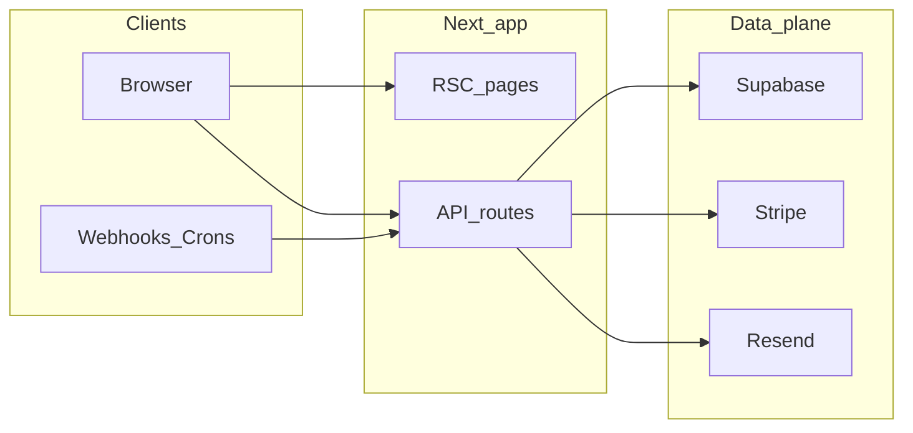

# Security pass checklist (full A–U)

**Principle:** Nothing in the security rubric is “out of scope.” Items that are not automated require **Owner**, **Frequency**, and **Evidence** (ticket, log excerpt, review date). Use “N/A” only with a one-line rationale (e.g. feature not deployed).

**Repo entry points:** [AGENTS.md](../AGENTS.md) (API rules), [RELEASE_GATE_RUNBOOK.md](./RELEASE_GATE_RUNBOOK.md), [SECURITY_API_ROUTE_COVERAGE.md](./SECURITY_API_ROUTE_COVERAGE.md) (regenerate with `npm run report:security-api-coverage`).

---

## A — Threat modeling and scope

| Item | Owner | Frequency | Evidence / artifact |
|------|--------|-----------|---------------------|
| Asset inventory maintained (App Router pages, `src/app/api/**`, crons, webhooks, external token flows, exports) | Eng | Quarterly / major release | Link to [SECURITY_API_ROUTE_COVERAGE.md](./SECURITY_API_ROUTE_COVERAGE.md) + Vercel cron list |
| Trust boundaries documented (browser ↔ Next ↔ Supabase ↔ Stripe/Resend/OpenAI ↔ integrations) | Eng | On architecture change | This section + diagram below |
| Adversary scenarios reviewed (unauth, cross-org, leaked cron secret, leaked webhook secret, malicious upload) | Eng | Quarterly | Meeting notes / ticket |

---

## B — Authentication and session

| Item | Owner | Frequency | Evidence / artifact |
|------|--------|-----------|---------------------|
| Every `route.ts` authenticates (session, cron secret, signed token, etc.) | Author + reviewer | Every API PR | `npm run check:api-route-tests` + review |
| `/api/*` not assumed protected by edge/proxy | Reviewer | Every API PR | [src/proxy.ts](../src/proxy.ts) (no API auth) |
| Session / cookie flags acceptable for deployment | Eng | Release | Supabase SSR + hosting docs |
| Brute-force / rate limits on sensitive endpoints | Eng | When adding auth surfaces | Rate-limit config if present |
| E2E auth smoke | Eng | Before release | `e2e/auth-flow.spec.ts`, `e2e/authenticated.spec.ts` with `E2E_*` env |

---

## C — Authorization and multi-tenancy (IDOR)

| Item | Owner | Frequency | Evidence / artifact |
|------|--------|-----------|---------------------|
| `createAdminClient()` queries filter by `organization_id` (or equivalent) from **server-derived** context | Author + reviewer | Every mutation/query PR | [AGENTS.md](../AGENTS.md) |
| No authorization from client-supplied org IDs | Reviewer | Every API PR | Code review |
| Nested resources (e.g. child rows) tied to parent org | Reviewer | When adding joins | Tests + review |
| Regression tests for org scope | Author | When touching scoped routes | [security-org-scope-queries.test.ts](../src/app/api/security-org-scope-queries.test.ts) |
| RLS as defense in depth (service role still scoped in app) | Eng | When changing policies | Supabase advisor + migrations |

---

## D — API design and HTTP semantics

| Item | Owner | Frequency | Evidence / artifact |
|------|--------|-----------|---------------------|
| GET does not mutate | Reviewer | PR | Review |
| Crons/webhooks idempotent on retry | Author | Cron/webhook PR | Code + logs |
| Errors do not leak stack traces / secrets in production | Eng | Release | Sentry + sample responses |
| CORS: only intentional cross-origin APIs exposed | Eng | When adding public API | `next.config` / route headers |

---

## E — Cron and background jobs

| Item | Owner | Frequency | Evidence / artifact |
|------|--------|-----------|---------------------|
| Cron secret verified | Author | Every cron route | [src/lib/v4/cron.ts](../src/lib/v4/cron.ts), [src/lib/v6/cron.ts](../src/lib/v6/cron.ts) |
| Vercel schedule alignment | CI | Every PR touching crons | `npm run check:vercel-cron` |
| Logs grep-friendly, no secrets | Author | PR | e.g. `[cron:v6]` prefix in V6 crons |

---

## F — Webhooks and inbound integrations

| Item | Owner | Frequency | Evidence / artifact |
|------|--------|-----------|---------------------|
| Inbound automation authorized | Author | Integration PR | [src/lib/security/inbound-automation-token.ts](../src/lib/security/inbound-automation-token.ts) |
| Stripe webhook signature verified | Author | Stripe PR | `src/app/api/stripe/webhook/route.ts` |
| Env documented | Eng | When adding secrets | [.env.example](../.env.example) |

---

## G — External and capability tokens

| Item | Owner | Frequency | Evidence / artifact |
|------|--------|-----------|---------------------|
| Token entropy, TTL, rotation documented | Eng | When changing token flows | Code + runbook |
| Minimal scope per token type | Reviewer | PR | Review |
| Tokens in URLs / referrers risk accepted or mitigated | Eng | When using query tokens | Decision recorded |

---

## H — Input validation and injection

| Item | Owner | Frequency | Evidence / artifact |
|------|--------|-----------|---------------------|
| SQL via parameterized Supabase client only | Reviewer | PR | No raw SQL concat |
| JSON / body validation before writes | Author | PR | Zod/manual checks |
| SSRF: URL fetch from user input reviewed | Author | Integration PR | Allowlist / block private IP |
| Path traversal on uploads/exports | Author | File PR | Canonical paths |
| `eval` / `new Function` / `dangerouslySetInnerHTML` | CI | Every PR | `npm run check:security-static` |

---

## I — File upload and download

| Item | Owner | Frequency | Evidence / artifact |
|------|--------|-----------|---------------------|
| Authz on upload/download | Author | PR | Route tests |
| Size and type limits | Author | PR | Route + storage config |
| Supabase Storage policies if used | Eng | When using buckets | Supabase UI / SQL |

---

## J — XSS, CSP, browser security

| Item | Owner | Frequency | Evidence / artifact |
|------|--------|-----------|---------------------|
| CSP and security headers | Eng | When changing `next.config` | [next.config.ts](../next.config.ts) |
| CSP report-only reviewed if reporting enabled | Eng | Quarterly | Reports / noise notes |
| XSS: avoid unsafe HTML rendering | Reviewer | PR | Grep + review |

---

## K — CSRF

| Item | Owner | Frequency | Evidence / artifact |
|------|--------|-----------|---------------------|
| Cookie session + SameSite assumptions documented | Eng | Release | App Router + Supabase SSR |
| Cross-site POST to cookie-authed routes assessed | Reviewer | When adding forms | Review notes |

---

## L — Secrets, crypto, configuration

| Item | Owner | Frequency | Evidence / artifact |
|------|--------|-----------|---------------------|
| No secrets in git or client bundles | Author | PR | Review |
| Production env complete | Release mgr | Pre-prod | `npm run preflight:release` |
| Key rotation runbook | Ops | Annually / incident | Doc / ticket |
| Integration encryption keys | Eng | When rotating | [.env.example](../.env.example) `INTEGRATION_TOKEN_ENCRYPTION_KEY` |

---

## M — Third-party services and AI

| Item | Owner | Frequency | Evidence / artifact |
|------|--------|-----------|---------------------|
| OpenAI (or other) keys server-only | Reviewer | PR | No `NEXT_PUBLIC_` on secrets |
| Data minimization to models | Eng / Legal | When changing extraction | Product note |
| Model output treated as untrusted | Author | PR | No auto-execution of model URLs/commands |

---

## N — Email and notifications

| Item | Owner | Frequency | Evidence / artifact |
|------|--------|-----------|---------------------|
| Header injection in user-controlled fields | Author | PR | Sanitization |
| Resend / deliverability abuse handling | Ops | As needed | Provider dashboard |

---

## O — Payments (Stripe)

| Item | Owner | Frequency | Evidence / artifact |
|------|--------|-----------|---------------------|
| Webhook signature + idempotency | Author | Payment PR | Webhook route |
| Never trust client-only for fulfillment | Reviewer | PR | Server-side verification |

---

## P — Dependencies and supply chain

| Item | Owner | Frequency | Evidence / artifact |
|------|--------|-----------|---------------------|
| `npm audit` addressed | Eng | PR / weekly | `npm run audit:moderate` or static script |
| Lockfile committed; CI uses `npm ci` | Eng | Always | CI config |
| SBOM on demand | Release | Major release | `npm run sbom` |

---

## Q — Infrastructure and deployment

| Item | Owner | Frequency | Evidence / artifact |
|------|--------|-----------|---------------------|
| TLS / HSTS (e.g. Vercel) | Ops | Default | Platform |
| Preview deploys: no prod secrets / webhooks | Eng | PR | Vercel env scoping |
| Supabase dashboard access (MFA, least privilege) | Ops | Quarterly | Vendor checklist |

---

## R — Privacy, retention, audit

| Item | Owner | Frequency | Evidence / artifact |
|------|--------|-----------|---------------------|
| PII map (profiles, emails, counterparties, contracts) | Eng / Legal | Annually | Doc |
| Deletion / cascade behavior | Eng | Schema change | Migrations + tests |
| Audit events for sensitive actions | Author | Feature PR | `audit_events` usage |

---

## S — Observability and incident response

| Item | Owner | Frequency | Evidence / artifact |
|------|--------|-----------|---------------------|
| Sentry DSN + release tagging | Eng | Deploy | [sentry-release.ts](../src/lib/observability/sentry-release.ts), env |
| PII scrubbing in Sentry | Eng | When adding fields | Sentry project settings |
| Incident: rotate secrets, revoke sessions | Ops | On incident | Runbook ticket |

---

## T — Continuous testing and automation

| Item | Owner | Frequency | Evidence / artifact |
|------|--------|-----------|---------------------|
| `npm run verify` before merge | Author | PR | CI / local |
| API route test coverage | CI | Every PR | `npm run check:api-route-tests` |
| Route coverage report | Eng | Major release | `npm run report:security-api-coverage` → [SECURITY_API_ROUTE_COVERAGE.md](./SECURITY_API_ROUTE_COVERAGE.md) |
| Static security greps + audit | CI / Eng | PR / weekly | `npm run check:security-static` |
| Staging synthetic pass | Ops | Pre-release | `npm run check:comprehensive-pass` (env-heavy) |

---

## U — People and process

| Item | Owner | Frequency | Evidence / artifact |
|------|--------|-----------|---------------------|
| Security-relevant PR checklist (link this doc) | Reviewer | PR | Checklist |
| Training / onboarding pointer | Eng lead | On hire | Link to AGENTS + this doc |
| Vulnerability disclosure contact | Org | Public policy | `security@` or GitHub SECURITY.md (if adopted) |

---

## Phase table (org-scope / test expansion)

When splitting work across PRs, record remaining routes or test gaps here (no silent deferrals):

| Phase | Scope | Owner | Target date | Status |
|-------|--------|-------|-------------|--------|
| 1 | Baseline org-scope tests + coverage report | Eng | | Done: `report:security-api-coverage`, findings/scorecards/segments GET tests |

(Add rows for additional domains or routes that still need org-scope assertions.)
