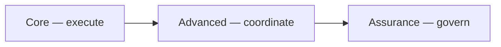

# Workspace modes: Core, Advanced, and Assurance — exhaustive product & UX reference

This document is a **single, exhaustive** guide to **what exists in the product** for each workspace mode: navigation, sub-navigation, reports, home dashboard blocks, notifications, email tone, search, settings, onboarding, role behavior, edge cases, and how modes **compare**. It is written for **product, design, content, CS, and sales**—not as an engineering spec (no implementation file walkthroughs).

**How to read it**

- **Mode** = workspace tier: **Core** → **Advanced** → **Assurance** (each tier **includes** everything below it that the org is allowed to use).
- **Plan / billing** can still cap what is purchasable (e.g. trial may not include Advanced or Assurance surfaces).
- **Deployment capabilities** (feature availability) can hide entire families even if an org “wants” them.
- **Workspace admin choices** (Settings → Product experience) can hide modules or nav for specific roles **inside** a mode.

---

## Table of contents

1. [Glossary](#1-glossary)
2. [Mental model: three layers](#2-mental-model-three-layers)
3. [Plans, roles, and how they intersect mode](#3-plans-roles-and-how-they-intersect-mode)
4. [Information architecture map](#4-information-architecture-map)
5. [Core mode — exhaustive](#5-core-mode--exhaustive)
6. [Advanced mode — exhaustive](#6-advanced-mode--exhaustive)
7. [Assurance mode — exhaustive](#7-assurance-mode--exhaustive)
8. [Tools, operations, and personal areas](#8-tools-operations-and-personal-areas)
9. [Reports hub: children, anchors, and who sees them](#9-reports-hub-children-anchors-and-who-sees-them)
10. [Report types and subscriptions (by mode)](#10-report-types-and-subscriptions-by-mode)
11. [Home dashboard: blocks and mode defaults](#11-home-dashboard-blocks-and-mode-defaults)
12. [Notifications: full taxonomy by tier](#12-notifications-full-taxonomy-by-tier)
13. [Email and outbound copy](#13-email-and-outbound-copy)
14. [Search, command palette, and recents](#14-search-command-palette-and-recents)
15. [Nav badges and when they disappear](#15-nav-badges-and-when-they-disappear)
16. [Bookmarks, deep links, and “missing from menu”](#16-bookmarks-deep-links-and-missing-from-menu)
17. [Settings → Product experience (complete admin checklist)](#17-settings--product-experience-complete-admin-checklist)
18. [Onboarding calibration: what it changes for UX](#18-onboarding-calibration-what-it-changes-for-ux)
19. [Upgrade and downgrade: user-visible effects](#19-upgrade-and-downgrade-user-visible-effects)
20. [Phased rollout playbooks](#20-phased-rollout-playbooks)
21. [Advanced vs Assurance: exhaustive semantic comparison](#21-advanced-vs-assurance-exhaustive-semantic-comparison)
22. [Empty states, errors, and support-facing scenarios](#22-empty-states-errors-and-support-facing-scenarios)
23. [Content style guide by mode](#23-content-style-guide-by-mode)
24. [Exhaustive FAQ (customer / CS / sales)](#24-exhaustive-faq-customer--cs--sales)
25. [Role × mode experience (expanded)](#25-role--mode-experience-expanded)
26. [Sales, solutions engineering, and demo checklist](#26-sales-solutions-engineering-and-demo-checklist)
27. [In-product module labels (admin hide lists)](#27-in-product-module-labels-admin-hide-lists)
28. [Microcopy that explicitly references mode (examples)](#28-microcopy-that-explicitly-references-mode-examples)
29. [Onboarding questionnaire — answer dimensions (UX meanings)](#29-onboarding-questionnaire--answer-dimensions-ux-meanings)
30. [Summary](#30-summary)

---

## 1. Glossary

| Term | Meaning for UX |
| ---- | -------------- |
| **Workspace** | Your customer’s organization tenant; one product instance they share. |
| **Workspace mode** | **Core**, **Advanced**, or **Assurance** — controls which **surfaces** are in-bounds for that org. |
| **Primary navigation** | Sidebar / top-level items people use every day (Home, Contracts, Work, …). |
| **Advanced primary navigation** | Decisions, Campaigns, Programs, Relationships — shown when mode is Advanced or Assurance **and** role + admin settings allow. |
| **Assurance navigation** | The **Assurance** item and its subtree (findings, policies, …) when mode is Assurance (or admin testing). |
| **Module hide** | Admin hides a **family** (e.g. “hide Campaigns”) even though the mode would allow it. |
| **Utility / Tools** | Secondary surfaces (intake, data quality, watchlists, …) and the **Tools** index — often used by ops, not first-week legal users. |
| **Feature flag** | Deployment-level switch; if off, the UI for that capability does not appear regardless of mode. |
| **Report pack / subscription** | Scheduled or recurring report delivery the org configured. |
| **Notification type** | A specific kind of email/Slack/in-app alert; each type is tied to a **tier** (Core / Advanced / Assurance). |

---

## 2. Mental model: three layers

| Layer | User-facing promise | Primary verbs |
| ----- | ------------------- | ------------- |
| **Core** | “We help you **execute** on contracts.” | Review, assign, approve, renew, resolve, evidence, report on operations. |
| **Advanced** | “We help you **coordinate** portfolio change.” | Decide, campaign, program, relate accounts/counterparties, analyze, compare, simulate. |
| **Assurance** | “We help you **govern** and **prove** control.” | Find, control, score, play, board, segment, evolve, graph health, interpret outcomes, govern autopilot. |

Higher tiers **add** chrome and content; they do not remove Core work. What *can* feel “removed” on **downgrade** is **scheduled** Advanced/Assurance content and **notification** types so channels stay honest (see §19).

---

## 3. Plans, roles, and how they intersect mode

### 3.1 Plans (product contract, plain language)

From the V10 eligibility narrative (product contract doc): **trial** is the smallest box (Core-style execution for a limited window, no Advanced/Assurance product promise). **Core / Advanced / Assurance** commercial plans expand caps (contracts, members, export rows) and which **scheduled report families** are legitimate. **Enterprise** still cannot override **role**, **isolation**, **privacy**, **audit**, or **hidden module** rules.

**UX implication:** Sales and CS should never describe Advanced-only journeys on a plan that does not include Advanced—even if an internal admin flips a toggle in a test org.

### 3.2 Roles (who can do what)

Roles in the product: **Admin**, **Editor**, **Viewer**, **Ops manager**, **Legal reviewer**, **Finance reviewer**, **Manager**.

**Cross-cutting UX:**

- **Admin** is the only role that can open **Settings → Product experience** and change workspace mode, module hides, landing path, search scope, home block hides, Assurance testing flag, autopilot execution opt-in, and email category mutes.
- **Billing**, **System health**, and **Policy registry & simulation** are **admin-only** nav destinations.
- Several **Advanced** and **Assurance** nav visibility defaults favor **admin, editor, ops manager, manager** for Advanced; **admin, ops manager, manager** for Assurance — unless admins customize role lists (see §17).

### 3.3 Mode × role matrix (navigation defaults)

| Surface | Core | Advanced / Assurance (default who sees Advanced primary nav) | Assurance (default who sees Assurance nav) |
| ------- | ---- | -------------------------------------------------------------- | -------------------------------------------- |
| Execution primary nav | Everyone (subject to role for actions) | Same | Same |
| Decisions, Campaigns, Programs, Relationships | Hidden | Admin, Editor, Ops manager, Manager (unless customized) | Same |
| Assurance hub | Hidden | Hidden | Admin, Ops manager, Manager (unless customized) |
| Persona dashboard (`/dashboard/persona`) | Hidden for Viewer, Legal reviewer, Finance reviewer | Visible to those roles | Same |

---

## 4. Information architecture map

### 4.1 Primary nav groups (conceptual buckets)

The product clusters URLs into four **buckets** for wayfinding:

| Group | What belongs there | Representative destinations |
| ----- | ------------------ | ----------------------------- |
| **Workspace** | Day-to-day execution | Home, Contracts, Review, Work, Renewals, Exceptions, Evidence studio, Reports, Settings |
| **Advanced** | Portfolio steering | Decisions, Campaigns, Programs, Relationship workspaces |
| **Assurance** | Governance hub | Assurance root and all `/assurance/...` children |
| **Tools** | Secondary tools index | Tools (`/more`) |

### 4.2 Workflow areas (for design system / IA labeling)

Labels used internally for grouping nav items: **Monitor**, **Workflows**, **Assurance**, **Insights**, **Workspace**. Examples:

- **Monitor**: Home, Persona dashboard.
- **Insights**: Reports (and report-pack surfaces).
- **Assurance**: Anything under `/assurance`.
- **Workspace**: Settings cluster, Tools, billing-adjacent settings.
- **Workflows**: Most contract and execution surfaces, plus Advanced steering when visible.

---

## 5. Core mode — exhaustive

### 5.1 Positioning

**Core** is the **default** for new workspaces: execution-first, minimal portfolio chrome, minimal governance chrome. The product should feel like “one workspace for legal ops delivery,” not “control tower + board deck factory.”

### 5.2 What is **in** for every Core user (navigation)

These items are the **spine** of Core (subject to role for **actions**, and subject to deployment flags where noted):

| Nav item | User sees… (from in-product descriptions) | Badge |
| -------- | -------------------------------------------- | ----- |
| **Home** | What needs action, what is due, and what you own. | — |
| **Contracts** | Contract records and portfolio context. Children: **All contracts**, **Review**. | — |
| **Review** | Extraction and field validation queue. | Review queue |
| **Work** | Tasks, obligations, approvals, and execution queues. Children: **Tasks**, **Obligations**, **Approvals**, **Renewals**, **Exceptions**, **Evidence**. | — |
| **Renewals** | Renewal horizon and structured renewal workspaces. | — |
| **Exceptions** | Open exceptions and policy-risk items. | — |
| **Evidence** | Evidence requests, templates, and export guidance. | — |
| **Reports** | Operational and portfolio reports (children vary by mode — see §9). | — |
| **Settings** | Members, workspace product mode, and workflow configuration. | — |

**Core UX intent:** Advanced destinations (Decisions, Campaigns, Programs, Relationships) and the Assurance hub are **not** part of the default mental model; they should not appear in primary nav for Core orgs.

### 5.3 Home dashboard (Core)

**Emphasis:** queues, due dates, ownership, execution health — **not** assurance snapshots or outcome-intelligence hero blocks by default.

**Optional blocks** (workspace admins can hide any of these in Settings → Product experience):

| Block (admin label) | What users experience when shown |
| ----------------- | -------------------------------- |
| **Control room strip (Advanced+)** | Typically **not** the Core story; often hidden by default recommendations for Core. |
| **Signal quality telemetry (Advanced+)** | Portfolio-style telemetry; Core orgs usually hide. |
| **Assurance snapshot card** | Governance snapshot; Core orgs usually hide. |
| **Outcome intelligence block** | Forward-looking outcomes framing; Core orgs usually hide. |
| **Assurance analytics signals** | Assurance-oriented analytics strip; Core orgs usually hide. |

**Copy note:** When these blocks are hidden, Home should not imply missing “premium” data—execution metrics remain authoritative.

### 5.4 Reports (Core) — what the hub contains

**Always-relevant children:**

- **Contract report packs** — operational packs tied to contracts.

**Children that are **not** primary in Core** (hash anchors may be suppressed or gated in nav for Core — users should not be trained to expect portfolio steering sections):

- Portfolio signals, portfolio analytics, campaign drift, capacity forecasts — **Advanced** story.
- Assurance analytics, outcome intelligence — **Assurance** story.

### 5.5 Report **types** available in Core (scheduling / creation UX)

These report families are treated as **Core-level** in the product contract:

- Monthly renewal readiness  
- Exception summary  
- Approvals SLA  
- Obligation overview  

Plus default execution-health style packs (e.g. weekly execution health) where offered.

### 5.6 Notifications users may still receive (Core tier)

See §12 for the full list — Core includes: reminders, saved view summaries, automation rules, approval requested/resolved, task assigned, obligation due, renewal due, exception assigned, review backlog, mentions.

### 5.7 Email tone (Core)

Outbound email uses **execution-friendly vocabulary** and avoids naming Assurance-only modules to people who have not bought into that surface (see §13 for substitution map).

### 5.8 Search & command palette (Core)

**Default onboarding recommendation:** **Core-only discoverability** — command palette recents and discovery surfaces only suggest destinations that belong to the Core story, so users are not dropped into Advanced/Assurance routes from search when the org is Core.

**Admin override:** Admins can set search to **match workspace mode** instead, but for Core that is identical in practice; the meaningful toggle is when the org is Advanced/Assurance but wants Core-only discovery.

### 5.9 Badges (Core)

- **Review queue** badge: follows Review visibility.  
- **Approvals / Obligations** badges: follow Work child visibility.  
- **Watchlists** badge: **typically absent** in Core (watchlists are not part of the simple Core chrome story).

### 5.10 Journeys (exhaustive checklist — Core)

1. **Intake → review → activate** — upload/import, field review, required fields, owner assignment.  
2. **Work queue triage** — tasks, obligations, approvals sorted by urgency.  
3. **Renewal posture** — horizon, checkpoints, notices (without decision-workspace language).  
4. **Exceptions** — open items, policy risk, resolution.  
5. **Evidence** — requests, responses, attestations, exports as allowed.  
6. **Reporting** — operational summaries to leadership without promising portfolio steering.  
7. **Settings** — members, integrations, operations, health — **admin** for mode changes.

---

## 6. Advanced mode — exhaustive

### 6.1 Positioning

**Advanced** = **everything in Core** plus **portfolio steering**: decisions, campaigns, programs, relationship intelligence, deeper analytics, maintenance and collaboration (when enabled), and compare/simulation experiences (when enabled).

### 6.2 Advanced additions to **primary navigation**

These items appear **in addition to** the Core spine when the deployment enables the relevant capability **and** the workspace has not hidden the module **and** the user’s role is allowed to see Advanced primary nav:

| Nav item | User sees… | Deployment gate (conceptual) |
| -------- | ---------- | ------------------------------ |
| **Decisions** | Decision workspaces and queue. | Decisions foundation |
| **Campaigns** | Change campaigns with preview and progress. | Portfolio campaigns |
| **Programs** | Manage contract program catalog and versions (also reachable under contracts). | Portfolio campaigns |
| **Relationships** | Account and counterparty summaries by stable keys. | Relationship layer |

### 6.3 Decisions — **sub-navigation** (every child)

| Child | Purpose for the user |
| ----- | -------------------- |
| **Decision queue** | Active queue view (`queue=active`). |
| **Manager review** | Manager-oriented review surface (when Control Room UX is enabled). |
| **Compare** | Side-by-side comparison for decisions (when Control Room UX is enabled). |
| **Renewals** | Filtered decision list for renewal-type work. |
| **Amendments** | Amendment-request stream. |
| **Waivers** | Waiver / exception disposition stream. |
| **Policy** | Policy-exception stream. |

### 6.4 Campaigns — **sub-navigation** (every child)

| Child | Purpose for the user |
| ----- | -------------------- |
| **Active** | In-flight campaigns. |
| **History** | Closed campaigns. |
| **Remediation** | Remediation-push style campaigns. |
| **Compare** | Compare campaigns & simulations (side-by-side progress and inputs). |
| **Simulations** | In-page simulations anchor (`#simulations`). |

### 6.5 Programs & relationships

- **Programs** — cross-contract program catalog and versions; ties renewal and change work across many agreements.  
- **Relationships** — entry to relationship workspaces; deep links into **accounts** and **counterparties** by stable keys for QBR-style conversations.

### 6.6 Advanced-only **operations** surfaces (when not hidden)

These appear in the broader nav catalog (often under operations / tools) — treat as **power** workflows:

| Item | User sees… |
| ---- | ---------- |
| **Intake** | Monitor intake queues and throughput. |
| **Analytics** | Portfolio trends and operational KPIs (`/contracts/analytics`). |
| **Collaboration** | Notes, mentions, field-level collaboration. |
| **Maintenance** | Data hygiene and cleanup operations. |
| **Execution graph** | Cross-work dependency view and blockers. |
| **Data quality** | Completeness, lineage confidence, remediation targets. |
| **Review cadence** | Weekly/monthly review ritual workspace. |

**Compare** (Decisions/Campaigns) and **simulations** are explicitly **Advanced storytelling** — use language about **options**, **tradeoffs**, and **portfolio impact**.

### 6.7 Reports (Advanced) — anchors users should see

Under **Reports**, these children become **first-class** for Advanced:

| Child | User intent |
| ----- | ----------- |
| **Portfolio signals** | Fast portfolio risk/signal read. |
| **Portfolio analytics** | Deeper analytics read. |
| **Campaign drift** | “Are we still on plan?” for campaigns. |
| **Capacity forecasts** | Load / capacity style read for planning. |

### 6.8 Report **types** unlocked at Advanced

- Decision queue summary  
- Campaign progress summary  
- Relationship workspace summary  
- Advanced compare outputs  

(Plus all Core types.)

### 6.9 Notifications unlocked at Advanced

- Decision assignment  
- Decision review request  
- Campaign status change  
- Campaign digest  
- Relationship alert  
- Simulation promotion result  

### 6.10 Search (Advanced)

**Default onboarding recommendation:** discovery **matches workspace mode** — users may find decisions, campaigns, programs, relationship entities via command palette / search where implemented.

### 6.11 Home (Advanced)

May show **control room** and **telemetry** strips when not hidden — still secondary to “what is due,” but the home narrative can acknowledge **portfolio motion**.

### 6.12 Journeys (exhaustive checklist — Advanced)

Everything in **§5.10**, plus:

13. **Steering committee** — open a decision workspace, attach contracts, route through review, finalize disposition.  
14. **Campaign lifecycle** — create campaign, monitor drift, run compare, promote simulation when applicable.  
15. **Program governance** — align many contracts to a program version.  
16. **Account / counterparty review** — use relationship summaries before negotiations or renewals.  
17. **Portfolio analytics** — answer volume, risk concentration, and capacity questions.  
18. **Collaboration loop** — mentions and field-level collaboration on contested clauses or fields.  
19. **Maintenance window** — hygiene passes after bulk imports or migrations.

---

## 7. Assurance mode — exhaustive

### 7.1 Positioning

**Assurance** = **everything in Advanced** plus the **Assurance hub** and **Assurance-tier** reporting, notifications, home blocks, and **governed automation** (Autopilot) — with **mutating execution** only when the org explicitly opts in **in Assurance mode**.

### 7.2 Assurance **primary** item and subtree

The **Assurance** nav item appears when deployment flags for any Assurance pillar are on **and** mode is Assurance (or admin testing for admins). Description in-product: **Findings, controls, scorecards, and playbooks.**

**Subtree (every child, in default order):**

| Child | User intent |
| ----- | ----------- |
| **Findings** | Triage and track issues / gaps. |
| **Control policies** | Define and monitor control checks (when control policies flag on). |
| **Scorecards** | Structured posture views across portfolio or segments. |
| **Playbooks** | Repeatable response / remediation packs (when adaptive playbooks flag on). |
| **Review boards** | Board-ready cycles and packets (when review boards flag on). |
| **Autopilot** | Automation rules and runs (when autopilot flag on). |
| **Segments** | Portfolio slices for assurance workflows (when segments flag on). |
| **Program evolution** | How programs change over time from an assurance lens. |
| **Health graph** | Portfolio health as a graph narrative. |

**Note:** **Outcome intelligence** may appear under Reports anchors and notifications — it is not always listed as a separate Assurance nav child in the same list; treat it as an **Assurance-tier insights** strand.

### 7.3 Reports (Assurance) — additional anchors

| Child | User intent |
| ----- | ----------- |
| **Assurance analytics** | Assurance-oriented analytics (requires Assurance core). |
| **Outcome intelligence** | Outcomes / effectiveness framing (when outcome intelligence is enabled). |

### 7.4 Report **types** unlocked at Assurance

All Core and Advanced types, plus:

- Findings summary  
- Policy compliance summary  
- Scorecard summary  
- Playbook effectiveness summary  
- Review board packet  
- Outcome intelligence summary  

### 7.5 Notifications unlocked at Assurance

- Finding opened  
- Control failure  
- Scorecard drop  
- Playbook run requested  
- Autopilot action completed  
- Review board ready  
- Outcome analysis updated  
- Review board packet  
- Review board Slack  

### 7.6 Home (Assurance)

May show **assurance snapshot**, **assurance signals**, and **outcome intelligence** blocks when not hidden — Home can answer **control and drift**, not only **due work**.

### 7.7 Autopilot — two-step trust model (UX)

1. **Assurance mode** — Autopilot is a **first-class** governed surface (configuration lives in Assurance; product messaging ties automation policy to governance).  
2. **Allow mutating autopilot execution** (admin checkbox) — Without this, automation stays in **dry-run / non-mutating** posture even in Assurance. **Copy must never imply silent mutation** when this is off.

### 7.8 Admin testing flag (support-only semantics)

**“Show Assurance navigation outside Assurance mode”** — for **workspace admins** validating IA. **Routes may still block** non-assurance orgs for real work; this is a **preview**, not a license change.

### 7.9 Journeys (exhaustive checklist — Assurance)

Everything in **§6.12**, plus:

20. **Control operating rhythm** — policy failures drive work queues and evidence.  
21. **Scorecard-driven QBR** — exec review of posture, not only task counts.  
22. **Playbook-driven response** — standardize what happens when a finding or control fails.  
23. **Review board cycle** — packet readiness, distribution, Slack hooks where configured.  
24. **Segment assurance** — targeted assurance passes on a slice of the portfolio.  
25. **Program evolution audit** — narrative for how programs drifted and were corrected.  
26. **Health graph triage** — graph-first identification of hotspots.  
27. **Outcome intelligence** — “did the playbooks and controls change outcomes?” narrative.  
28. **Autopilot governance** — rules, approvals, completion signals, revert posture (as product allows).

---

## 8. Tools, operations, and personal areas

### 8.1 Tools index (`/more`)

Description: **Secondary tools, maintenance, and admin-only destinations.**  
This is the **catch-all** for power users — not the first-day path for Core legal reviewers.

### 8.2 Operations section (representative items)

| Item | Description (in-product) |
| ---- | ------------------------- |
| **Approvals** | SLA-governed approvals and escalation bottlenecks. |
| **Obligations** | Due obligations, ownership, and evidence status. |
| **Report packs** | Operational report packs and trend insights (`/contracts/reports`). |

### 8.3 Personal section

| Item | Description |
| ---- | ----------- |
| **Watchlists** | Contracts you explicitly monitor. |
| **Persona dashboard** | Role-specific dashboard views. |

### 8.4 Workspace section (admin-heavy)

| Item | Description |
| ---- | ----------- |
| **Billing** | Plan, invoices, and subscription health. |
| **System health** | Delivery retries, cron posture, operational health. |
| **Policy registry & simulation** | Policy registry and governance notes (contract-level simulation availability is described in Policy settings copy as tied to Advanced/Assurance mode). |

### 8.5 Contextual CTAs (“handoffs”) across modes

Across contract and work surfaces, Oblixa uses **inline handoffs** when the “next best” place to continue work lives in **Advanced** or **Assurance**. UX writers should keep **three patterns** consistent:

| Pattern | When to use | User should feel… |
| ------- | ------------- | ------------------ |
| **Higher mode required** | Feature exists but workspace is Core (or Advanced for Assurance-only) | “My org is not configured for this yet,” not “the product is broken.” |
| **Module hidden** | Mode allows it but admin hid the family | “My admin turned this off on purpose.” |
| **Role limited** | Mode allows it but nav customization excludes this role | “I need a manager/admin to widen access,” not “Oblixa deleted Decisions.” |

**Copy ingredients that work well**

- Name the **destination** (e.g. “Decisions,” “Campaigns,” “Assurance”).  
- Name the **requirement** (Advanced workspace, Assurance workspace).  
- Offer a **single next step** (contact admin, open Settings → Product, open eligible alternative like Work queue).

---

## 9. Reports hub: children, anchors, and who sees them

Parent item: **Reports** — “Operational and portfolio reports.”

| Child link | Minimum mode for the **Reports nav child** to show |
| ---------- | ---------------------------------------------------- |
| Contract report packs | Core |
| Portfolio signals | Advanced |
| Portfolio analytics | Advanced |
| Assurance analytics | Assurance (and Assurance core flag) |
| Campaign drift | Advanced |
| Capacity forecasts | Advanced |
| Outcome intelligence | Assurance (and outcome intelligence flag) |

**UX writing rule:** In Core, do not anchor marketing copy on portfolio hash URLs. In Advanced, portfolio anchors are fair game. In Assurance, add assurance + outcome anchors.

---

## 10. Report types and subscriptions (by mode)

### 10.1 Core-eligible report types

- Monthly renewal readiness  
- Exception summary  
- Approvals SLA  
- Obligation overview  
- Weekly execution health (default family in product logic)

### 10.2 Advanced-only report types

- Decision queue summary  
- Campaign progress summary  
- Relationship workspace summary  
- Advanced compare outputs  

### 10.3 Assurance-only report types

- Findings summary  
- Policy compliance summary  
- Scorecard summary  
- Playbook effectiveness summary  
- Review board packet  
- Outcome intelligence summary  

### 10.4 Downgrade effect (user story)

If an org **steps down** a mode, **subscriptions** to report types that no longer match the mode are **turned off** so recipients do not keep receiving “wrong tier” PDFs or emails. Communicate: *“We paused schedules that don’t match your workspace mode.”*

---

## 11. Home dashboard: blocks and mode defaults

| Block | Label in Settings | Typical Core | Typical Advanced | Typical Assurance |
| ----- | ----------------- | ------------ | ------------------ | ------------------- |
| `control_room_strip` | Control room strip (Advanced+) | Hidden by recommendation | May show | May show |
| `telemetry_compact` | Signal quality telemetry (Advanced+) | Hidden by recommendation | May show | May show |
| `v6_assurance_snapshot` | Assurance snapshot card | Hidden | Hidden by recommendation | May show |
| `outcome_intelligence` | Outcome intelligence block | Hidden | Hidden | May show (often last to reveal) |
| `assurance_signals` | Assurance analytics signals | Hidden | Hidden by recommendation | May show |

Admins can always **manually hide** blocks to reduce noise for busy execution teams.

---

## 12. Notifications: full taxonomy by tier

Each row is a **notification type** the delivery system knows about. **Tier** controls whether a **Core** org should receive it at all when policies follow workspace mode.

### 12.1 Core tier (always in-bounds for Core)

| Type | What the user should understand |
| ---- | -------------------------------- |
| `reminder_due` | A reminder fired. |
| `saved_view_summary` | Digest of a saved view / summary report. |
| `automation_rule` | Rule-based automation nudge (execution-class). |
| `approval_requested` | Someone needs an approval. |
| `approval_resolved` | Approval completed. |
| `task_assigned` | Task ownership changed. |
| `obligation_due` | Obligation coming due or due. |
| `renewal_due` | Renewal milestone pressure. |
| `exception_assigned` | Exception needs owner / action. |
| `review_backlog` | Field review queue pressure. |
| `mention` | Collaboration mention (when collaboration is in use). |

### 12.2 Advanced tier (Core orgs should not receive as “promised product”)

| Type | User story |
| ---- | ---------- |
| `decision_assignment` | You own or must weigh a decision workspace. |
| `decision_review_request` | Someone escalated a decision for review. |
| `campaign_status_change` | Campaign moved state. |
| `campaign_digest` | Periodic campaign summary. |
| `relationship_alert` | Relationship workspace needs attention. |
| `simulation_promotion_result` | A simulation outcome was promoted or rejected. |

### 12.3 Assurance tier (Advanced orgs still should not receive as assurance promise)

| Type | User story |
| ---- | ---------- |
| `finding_opened` | New or reopened finding. |
| `control_failure` | Control check failed. |
| `scorecard_drop` | Scorecard posture worsened materially. |
| `playbook_run_requested` | Playbook run requested / staged. |
| `autopilot_action_completed` | Autopilot finished an action (governed context). |
| `review_board_ready` | Board packet or cycle ready. |
| `outcome_analysis_updated` | Outcome intelligence refreshed. |
| `review_board_packet` | Packet artifact emphasis. |
| `review_board_slack` | Slack-oriented board hook. |

---

## 13. Email and outbound copy

### 13.1 Policy (plain language)

- **Core** workspaces: marketing and system email should read like **execution ops**, not like the customer bought a **board-ready assurance** product.  
- **Advanced / Assurance**: product vocabulary can name Decisions, Campaigns, Assurance artifacts.

### 13.2 Substitution map (Core → neutral)

When degrading copy for Core, the product replaces phrases roughly as:

| Avoid in Core email (example) | Prefer |
| ------------------------------- | ------ |
| Outcome intelligence | Outcomes |
| Program evolution | Program changes |
| Segment assurance | Segment review |
| Portfolio health graph / health graph | Portfolio health |
| Review board(s) | Review cycle(s) |
| Control policies | Policy checks |
| Scorecards | Summaries |
| Playbooks | Response packs |
| Autopilot | Automation |
| Assurance analytics | Analytics |
| Assurance (generic) | Compliance |

**Writer checklist:** If the CTA links to a route Core users cannot open, the email is wrong — fix the CTA or the mode.

---

## 14. Search, command palette, and recents

| Setting | User-visible behavior |
| ------- | ---------------------- |
| **Match workspace mode visibility** | Discovery surfaces respect mode + hides + role (what you can open, you can find). |
| **Core-only discoverability** | Even in Advanced/Assurance, command palette / recents avoid suggesting non-Core destinations — useful during **phased rollouts** or highly regulated teams. |

### 14.1 “Things search is aware of” (conceptual inventory)

Search / indexing concepts include: contracts, tasks, obligations, approvals, renewals, exceptions, evidence, reports; and when mode allows: decisions, campaigns, programs, relationship workspaces; and in Assurance: findings, control policies, scorecards, playbooks, review boards, segments, program evolution.

---

## 15. Nav badges and when they disappear

| Badge | Meaning | When it is removed from chrome |
| ----- | ------- | -------------------------------- |
| Review queue | Items in field review | Review nav not visible |
| Approvals | SLA pressure | Approvals child not visible |
| Obligations | Due obligations | Obligations child not visible |
| Watchlists | Watched contracts | Core mode or watchlists hidden / not navigable |

---

## 16. Bookmarks, deep links, and “missing from menu”

**Critical UX fact:** Hiding something from the **sidebar** does not mean the URL is impossible to type or bookmark.

**Expected behaviors:**

- **Forbidden / not available** states when the org mode or plan does not allow a destination.  
- **Empty module** states when mode allows but module is hidden.  
- **Admin preview** when testing flags are on.

**Support macro:** “If you can’t see Decisions, check workspace mode, deployment flags, module hide list, and whether your role is in the customized Advanced nav list.”

---

## 17. Settings → Product experience (complete admin checklist)

Only **workspace admins** see this page. It controls:

1. **Workspace mode** — Core / Advanced / Assurance (with in-page explainer for what each adds).  
2. **Hide advanced modules** — Decisions, Campaigns, Programs, Relationship workspaces, Advanced Analytics, Maintenance, Collaboration, Compare views.  
3. **Customize which roles see advanced primary navigation** — roles: Admin, Editor, Viewer, Ops manager, Legal reviewer, Finance reviewer, Manager. If customization is on and **no** roles checked → **only admins** see Advanced primary items.  
4. **Customize which roles see Assurance navigation** (Assurance mode only) — same role list; empty selection → **only admins** see Assurance nav.  
5. **Hide tool modules** — Intake, Data quality, Review cadence, Watchlists, Execution graph, Approval workload, Approval SLA simulator, Tools index.  
6. **Hide assurance modules** (Assurance mode only) — Findings, Control policies, Scorecards, Playbooks, Autopilot, Review boards, Segments, Program evolution, Health graph, Outcome intelligence.  
7. **Search scope** — Match mode vs Core-only discoverability.  
8. **Default landing path** — Must be valid for the selected mode (Core cannot default-land on Advanced/Assurance-only routes).  
9. **Admin testing: Assurance nav outside Assurance mode** — preview for admins; routes may still enforce Assurance for real mutations.  
10. **Allow mutating autopilot execution** — only meaningful in Assurance; otherwise dry-run posture.  
11. **Home dashboard blocks** — per-block hide list (see §11).  
12. **Email notification categories** — mute categories (blocked types) for operational email tuning.  
13. **Reset to defaults** / **Run calibration again** — questionnaire vs applied settings (copy explains questionnaire does not override until applied).

---

## 18. Onboarding calibration: what it changes for UX

The questionnaire scores **four human dimensions** (conceptually):

1. **Execution depth** — how heavy day-to-day contract ops is.  
2. **Coordination complexity** — team size, handoffs, renewal/decision pressure.  
3. **Assurance maturity** — risk, controls, structured policy culture.  
4. **Simplicity preference** — how much UI the customer wants on day one.

**Outputs that change first-run UX:**

- Recommended **workspace mode**.  
- Which **Advanced** and **Assurance** modules start **revealed** vs **hidden**.  
- Which **utility** tools start hidden (e.g. intake only if import intent).  
- Recommended **default landing** (e.g. Review vs Work vs Dashboard vs Product settings).  
- Recommended **dashboard profile** (core vs advanced vs assurance_lite).  
- Recommended **search scope** (Core-only vs match mode).  
- Recommended **notification** and **report** profiles (e.g. suppress advanced tiers on Core).  
- **Setup checklist** steps for onboarding banners (bulk import vs review-first, etc.).

**Important copy point:** Calibration **recommends**; **Settings → Product** remains source of truth until an admin applies changes.

---

## 19. Upgrade and downgrade: user-visible effects

### 19.1 Upgrade (Core → Advanced → Assurance)

**What users notice first**

- New sidebar items and command palette destinations.  
- New report pack types available to schedule.  
- New notification types begin delivering.  
- Home may gain portfolio or assurance strips.  
- Email vocabulary may shift from neutral to full product names.

**CS talking points**

- “You’ll see Decisions/Campaigns…” only if **mode + deployment + module hides** allow.  
- “You’ll get new Slack/email types…” — confirm notification channels.

### 19.2 Downgrade (e.g. Assurance → Core)

**What users notice**

- Advanced/Assurance nav disappears (except admin testing quirks).  
- **Scheduled** reports that required higher tier **stop** (subscriptions paused).  
- **Email + Slack blocked lists** gain higher-tier notification types automatically so channels don’t contradict the new mode.  
- Command palette / recents shrink if search scope was match-mode before.

**What users may still have**

- Historical records from when the org was higher tier — **data may exist**, but **promises and schedules** should align with the new mode.

---

## 20. Phased rollout playbooks

| Goal | Suggested combination |
| ---- | --------------------- |
| “Managers pilot Decisions first” | Advanced mode + **customize Advanced nav roles** to managers (then expand). |
| “Everyone Advanced, nobody Assurance yet” | Advanced mode; Assurance nav irrelevant. |
| “Assurance only for admins until board meeting” | Assurance mode + **Assurance nav roles** = admin only; widen after. |
| “Advanced org but search feels Core” | Advanced mode + **Core-only discoverability**. |
| “Hide campaigns until programs are clean” | Advanced mode + **hide Campaigns** module. |

---

## 21. Advanced vs Assurance: exhaustive semantic comparison

| Question | Advanced answer | Assurance answer |
| -------- | --------------- | ------------------ |
| Primary metaphor | **Steering** — choose paths, run programs, push campaigns. | **Governing** — prove control, measure posture, close loops. |
| Hero objects | Decision workspace, Campaign, Program, Relationship summary. | Finding, Control, Scorecard, Playbook, Review board, Segment. |
| Time horizon | Quarters / renewal cycles / campaign windows. | Control periods, audit quarters, board cycles, outcome windows. |
| Success metrics | Throughput, decision latency, campaign drift, relationship coverage. | Control pass rate, finding burn-down, scorecard stability, outcome deltas. |
| Failure modes | Stalled decisions, stuck campaigns, bad prioritization. | Control failures, unmanaged findings, scorecard drops, weak evidence. |
| Collaboration tone | Cross-functional **execution** coordination. | **Evidence** and **accountability** coordination. |
| Automation framing | Simulations / promotions — “what if we change the portfolio?” | Autopilot — “what may the system change under policy?” |
| Executive narrative | “Are we on track operationally?” | “Are we in control and improving?” |
| Sales demo risk | Looks “smart” fast — avoid implying assurance without Assurance. | Must show **governance** depth, not only dashboards. |

---

## 22. Empty states, errors, and support-facing scenarios

| Scenario | What the user should see / hear |
| -------- | -------------------------------- |
| Mode = Core, user opens Advanced URL | Not available / upgrade messaging; not a blank screen. |
| Mode = Advanced, module hidden | “Hidden for this workspace” style guidance; link to Settings if admin. |
| Deployment flag off | “Not enabled” — not confused with mode. |
| Assurance nav testing on, user is not admin | No preview nav. |
| Autopilot execution off | Clear **dry-run** / non-mutating language in Autopilot surfaces. |
| Downgrade with active Slack digests | Fewer types; explain “paused by workspace mode.” |

---

## 23. Content style guide by mode

| Element | Core | Advanced | Assurance |
| ------- |------|----------|-----------|
| Hero headline | Due, blocked, owned | Portfolio motion + coordination | Control + outcomes |
| CTA verbs | Review, assign, approve, renew | Decide, compare, campaign | Remediate, attest, board, govern |
| Avoid | Decision queue as default metaphor | Implying audit-grade proof without Assurance modules | Over-selling “autopilot magic” |
| Metrics | Counts, SLAs, dates | Drift, capacity, disposition | Pass/fail, posture, outcomes |

---

## 24. Exhaustive FAQ (customer / CS / sales)

| Question | Short answer |
| -------- | ------------- |
| “We’re on Core—why can’t my team see Campaigns?” | Campaigns are an **Advanced** surface. Upgrade mode (and plan) or stop promising Campaigns in training. |
| “We’re Advanced—where is Assurance?” | Assurance hub appears only in **Assurance** mode (plus deployment flags). |
| “We’re Assurance—why don’t I see Autopilot?” | Module may be **hidden**, or deployment flag off, or your **role** excluded from Assurance nav customization. |
| “Autopilot is visible—why didn’t anything change in the record?” | **Mutating execution** may still be **off**; dry-run posture is intentional. |
| “Why did my weekly ‘decisions’ email stop?” | Workspace **downgraded** or notification category **muted**; check mode + email category settings + Operations settings. |
| “Why did my report subscription vanish?” | Report type may require **Advanced/Assurance**; downgrade **pauses** incompatible schedules. |
| “Search finds a page I can’t open.” | Check **role**, **module hide**, and **mode**; search scope may need **Core-only** during rollout. |
| “Persona dashboard disappeared for paralegals.” | In **Core**, persona may be **hidden** for viewer/legal/finance roles—by design to reduce noise. |
| “Can we preview Assurance before buying?” | Admins can use **testing nav** preview; real governed workflows still require Assurance mode + entitlements. |
| “Is Evidence ‘Assurance’?” | **No** — Evidence studio is a **Core** execution surface; Assurance is a **separate governance** layer on top when enabled. |

---

## 25. Role × mode experience (expanded)

This is **not** the full permission matrix for every button—it is **what changes in chrome and primary workflows** by role when mode changes.

| Role | Core — what they usually “live in” | Advanced — added chrome | Assurance — added chrome |
| ---- | ----------------------------------- | ------------------------- | ------------------------- |
| **Viewer** | Read contracts, reports, queues; persona may be hidden | May see Advanced nav if included in customized role list; otherwise same as Core for nav | Assurance nav only if included in Assurance role customization |
| **Legal reviewer** | Review + work + renewals + exceptions + evidence | Same Advanced nav rules as viewer | Same Assurance nav rules as viewer |
| **Finance reviewer** | Approvals-heavy + reports | Same | Same |
| **Editor** | Creates/updates records across execution surfaces | Default Advanced primary nav **on** unless customized away | Assurance nav per customization (defaults often on for ops/manager/admin) |
| **Ops manager** | Work triage, assignments, health-ish views | Default Advanced primary nav **on** | Default Assurance nav **on** (unless customized) |
| **Manager** | Oversight + approvals posture | Default Advanced primary nav **on** | Default Assurance nav **on** (unless customized) |
| **Admin** | Everything + Settings → Product | Everything + can pilot Advanced nav to admins-only | Everything + Assurance testing flag + autopilot execution toggle |

---

## 26. Sales, solutions engineering, and demo checklist

1. **Confirm plan** before narrating Advanced/Assurance.  
2. **Confirm deployment flags** (Decisions, Campaigns, Relationship layer, Assurance pillars, Outcome intelligence).  
3. **Confirm workspace mode** in a live org or demo tenant.  
4. **Walk the spine**: Home → Work → Renewals in **every** mode.  
5. **Only in Advanced+**: Decisions queue, Campaign active/history, Programs, Relationships.  
6. **Only in Assurance**: Assurance hub children + assurance reports anchors + autopilot story.  
7. **Show downgrade honesty**: what pauses in email/Slack if they shrink tier.  
8. **Security/compliance narrative**: Assurance mode + explicit autopilot execution as **governed** automation, not “silent AI.”

---

## 27. In-product module labels (admin hide lists)

These are the **exact family names** admins tick to hide modules (wording follows product labels).

**Advanced modules (hide list):** Decisions, Campaigns, Programs, Relationship workspaces, Advanced Analytics, Maintenance, Collaboration, Compare views.

**Assurance modules (hide list):** Findings, Control policies, Scorecards, Playbooks, Autopilot, Review boards, Segments, Program evolution, Health graph, Outcome intelligence.

**Tool modules (hide list):** Intake, Data quality, Review cadence, Watchlists, Execution graph, Approval workload, Approval SLA simulator, Tools index.

---

## 28. Microcopy that explicitly references mode (examples)

Some surfaces teach users that **integrations differ by mode**. Example pattern (Renewals / Slack-style summaries): when the workspace **does not** include the right mode for Slack digests, users see messaging that renewal summaries **stay in the queue**, and that **Advanced and Assurance** workspaces may post the same outcome summary to Slack. Use this as a reference for **honest progressive disclosure** elsewhere (do not promise channel digests the mode cannot support).

---

## 29. Onboarding questionnaire — answer dimensions (UX meanings)

These are the **human axes** the questionnaire touches (names paraphrased from internal calibration dimensions):

| Axis | What we learn | UX outcome |
| ---- | -------------- | ---------- |
| **Primary use case** | Dates-only vs tasks vs coordination vs assurance | Starting mode + which modules to reveal |
| **Team model** | Solo vs small vs medium vs cross-functional | Whether coordination surfaces default on |
| **Workflow maturity** | Spreadsheet → structured policy | Whether assurance signals score high |
| **Main pain** | Findability vs tasks vs decisions vs risk | Landing path + module emphasis |
| **Complexity preference** | Simplest → full visibility | **Ceiling** on recommended mode |
| **Setup intent** | Import vs review vs organize vs configure advanced | Default landing + checklist steps |
| **Assurance intent** | Not now vs yes workspace | Whether Assurance is even considered |

---

## 30. Summary

**Core** delivers the full **execution** workspace: contracts, review, work, renewals, exceptions, evidence, operational reports, and execution-grade notifications—with **neutral** outbound language and a **smaller** home and discovery footprint.

**Advanced** adds **coordination**: decisions, campaigns, programs, relationships, portfolio analytics, compare/simulation storylines, richer reports anchors, and coordination-tier notifications—while Assurance chrome stays out of the default story.

**Assurance** adds **governance**: the Assurance hub (findings through health graph), assurance reports and anchors, assurance-tier notifications, richer home blocks, outcome intelligence—and **Autopilot** as a governed automation surface, with **mutating execution** only after explicit admin opt-in **in Assurance mode**.

Together, the three modes let customers grow from **“run contracts”** to **“steer the portfolio”** to **“prove control and improve outcomes”** without breaking email, schedules, or search expectations along the way.
